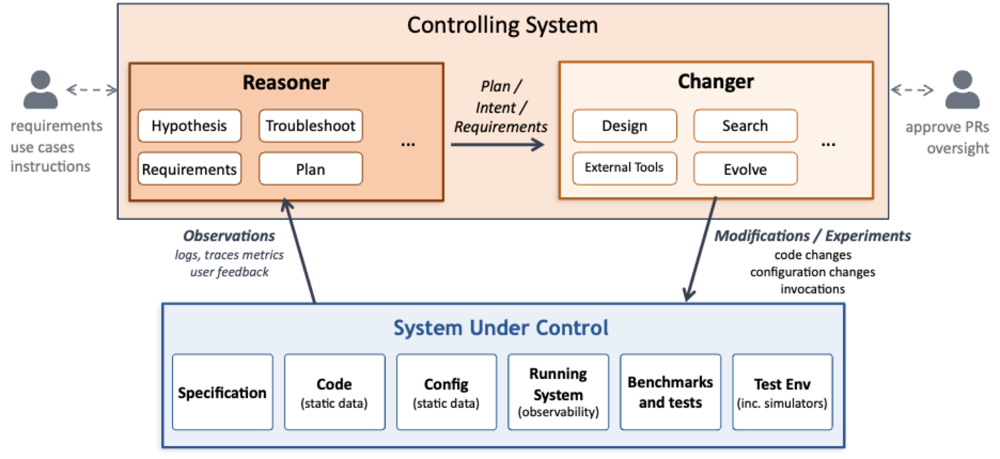

# AI Native Systems: Autonomous Evolution at Machine Speed

*Tamar Eilam, Fabio Oliveira, Michael Factor*

## 1. Introduction: The Bottleneck in System Evolution and AI Native Systems

Modern software systems, especially those that serve AI workloads, are extraordinarily complex and must evolve continuously under pressure from new models, new hardware, changing usage patterns, and shifting business objectives. These pressures drive constant change, both in configuration and in code. Yet, even with increasingly powerful AI tools, improvement of such systems remains fundamentally human-driven. Engineers inspect logs and metrics, diagnose problems, open tickets, draft and review pull requests, extend tests, and orchestrate deployments through fragmented workflows. AI assists at each step, but progress is mediated by people, one decision at a time.

<!-- more -->

This human-mediated loop has become the dominant bottleneck in system evolution. More importantly, it biases systems toward reactive change. When something breaks or a service level objective (SLO) is violated, attention follows. When nothing appears broken, latent inefficiencies persist unnoticed. Opportunities to improve cost, performance, or reliability go unrealized simply because no alert was fired. In other words, there is no proactive evolution of the system based upon the observed behavior of the system in production.

This observation motivates the central question of our work: What if a deployed system could observe its own behavior, hypothesize potential code or configuration improvements, design and implement them, experimentally validate their impact, deploy to production in a controlled and governed manner, and repeat continuously at a pace and scale no human team can match? What if this feedback loop operated not only in response to failures, but proactively, identifying and addressing inefficiencies long before they manifest as problems? And what if this process were grounded in the context of a specific deployment, workload pattern and underlying infrastructure, enabling hyper-specialization where a system is always optimal for how it is actually used?

*AI Native Systems* are our answer to these questions. An AI Native System is a complex software system that continuously and autonomously closes the loop from observation to reasoning to change to validation to deployment, with AI as the primary agent driving this process. Over time, the system evolves itself, modifying both code and configuration, while adhering to constraints and objectives defined by humans. Later we give some concrete examples and share initial results.

AI Native Systems differ fundamentally from earlier visions of autonomic computing or AIOps. Rather than treating operations and development as separate domains, AI Native Systems unify them under a single engineering discipline. Configuration changes, deployment updates, defect fixes, and new features are all treated uniformly as software engineering changes. They are all motivated by the system's own observations, reasoned about and planned by collaborating AI agents, and executed using standard development practices, including specification updates, tests generation, planning, execution, and validation. Governance, safety, and trust are not afterthoughts; they are architectural requirements. All changes are driven by documented observation and reasoning applying standard software engineering practices autonomously and continuously.

## 2. The AI Native Architecture

An AI Native system consists of the System Under Control and the Controlling System as shown in the following figure and described below.

<figure markdown="span">
  { width="100%" }
  <figcaption>The AI Native Architecture: the Controlling System (Reasoner and Changer) continuously observes, reasons about, and evolves the System Under Control.</figcaption>
</figure>

### 2.1 System Under Control

The System Under Control is the software system that delivers business value and is subject to continuous evolution. Examples include inference platforms, collections of accelerator kernels and their compilation pipelines, and large systems such as filesystems or resource managers. The System Under Control is not necessarily an AI system or a system using AI.

These systems are typically distributed and multi-component, with complex emergent behavior. They are also multi-objective: performance, cost, fairness, correctness, and stability all matter and must be traded off against one another. The relative importance of these objectives is typically ill-defined. Reasoning about such systems locally is difficult; improving them holistically is harder still.

### 2.2 The Controlling System

The Controlling System is the agentic AI-driven layer that continuously improves the System Under Control. Conceptually, it has two functions that operate together across all timescales: a Reasoner and a Changer.

The Reasoner observes system behavior through telemetry data, including logs and a variety of metrics. It forms and refines hypotheses, detects problems and latent opportunities, identifies new requirements, and proposes goals that reflect multi-objective tradeoffs. It can also be given new requirements explicitly.

The Changer determines how to achieve those goals. It inspects code and configuration, plans multi-step changes, runs experiments in test environments or simulators, and produces concrete artifacts such as pull requests, tests, and updated configurations. It may also address limitations in the existing set of tests and benchmarks as well as the testing environment, e.g., by creating a new simulator.

The Reasoner and Changer participate in all classes of change. Both a fast configuration update to address a workload spike and a long-running refactor to support a new model backend involve reasoning about objectives and implementing validated changes. The distinction between the Reasoner and the Changer is functional, not temporal.

### 2.3 The Continuous Meta-Loop

Together, the Reasoner and Changer execute a continuous meta-loop: observation, reasoning, change, experimentation, and validation. This loop runs continuously, not only in response to failures. It operates across timescales ranging from seconds, for configuration adjustments, to months, for architectural evolution. It may be driven by explicit user request, by empirical observation of the system being used in production, or by experimental analysis in a test environment.

A defining feature of this loop is that runtime behavior feeds back into design-time decisions. Execution profiles, workload distributions, and real-world telemetry inform not only tuning decisions but also structural changes to code and algorithms. The system evolves based on how it is actually used, not solely on offline assumptions.

Crucially, this loop preserves standard software engineering discipline. The goal is not to bypass these practices, but to apply them autonomously, at machine speed.

### 2.4 What Makes a System AI Native-Ready?

Not every system is equally amenable to the AI Native approach a priori. Systems with strong modularity, clear APIs, and rich semantic observability make it easier for the Reasoner to reason and for the Changer to act safely. Equally important is validation infrastructure: tests, benchmarks, and sometimes simulators form the substrate on which safe exploration is possible.

Established systems are not excluded, but they often require a phased approach. AI can assist in extracting specifications and invariants, introducing modular boundaries, and building validation scaffolding. Over time, this enables incremental evolution within well-defined safety bounds. In other words, we use an AI Native approach to make established systems AI Native-Ready.

## 3. Specifications, Experimentation, Validation, and Trustworthiness

### 3.1 Specifications

AI Native Systems rely on explicit expressions of intent both as input from the human engineer and to reflect decisions made by the reasoner. Specifications capture functional requirements, invariants, and API semantics, i.e., the boundaries that must not be crossed. The reasoner can add but must not remove boundaries. The set of tests that define whether the system is correctly behaving is directly derived from the specification.

Part of the specification can include objective functions that capture what the system is trying to optimize across multiple dimensions such as performance, cost, and stability. Often the relative tradeoff between these dimensions cannot be generally and precisely specified, complicating the task.

The specification (along with the tests and objective functions) allows evaluating whether a proposed change is both correct and beneficial. The level of specificity, degrees of freedom, and structure and formalism depend on the domain and the risk tolerance. Specifications may be in natural language, formal representations, or some mix. Crucially, the specification is a live document. It evolves together with the system and must always be kept in sync with it. This consistency can be ensured by treating the specification and not the code as the source of authoritative truth. Its creation and evolution are iterative processes where human and AI collaborate.

Given the foundational role of specifications and tests, AI Native Systems have a strong affinity to Spec-Driven and Test-Driven Development. However, AI Native Systems go further than the current state of the art by envisioning a process that does not complete when the artifact is produced and released. Rather, the AI Native System operates alongside the running code artifact, evolving the specification and tests; in this way, it drives operational fine tuning and functional evolution based on observations, using a unified specification.

### 3.2 Experimentation to Drive Changes

A foundational capability of AI Native Systems is the ability to systematically explore change through experimentation. Given observations of system behavior, the Controlling System can generate alternative realizations of code or configuration and evaluate them against the system's objectives. Rather than relying on a single proposed fix, the system can explore a space of possibilities, learning from prior attempts and refining future hypotheses based on empirical evidence.

This approach builds on a growing body of "evolutionary" techniques for improving systems code. Recent work in systems such as SkyDiscover, KernelBench, OpenEvolve, and others have demonstrated that models can propose non-obvious improvements and iteratively refine them through feedback. AI Native Systems generalize these ideas beyond human-directed and human-initiated code improvements, embedding experimentation into a continuous, governed loop that spans configuration tuning, algorithmic changes, and structural refactoring. Experimentation thus becomes not an occasional activity, but a continuous driver of learning and adaptation, closing the loop between observation, hypothesis, and durable system improvement.

### 3.3 Validation as a First-Class Artifact

In AI Native Systems, validation assets are as important as implementation and configuration artifacts. Tests, benchmarks, and simulators are not static; they must be created, maintained, and evolved alongside the system itself. The Changer is responsible not only for generating code, but also for expanding and refining validation coverage.

Cheap and fast validation is desirable but not always possible. Different domains require different strategies, from simulators and shadow deployments to reference checks and golden traces. Regardless of the approach, validation must reflect the system's multi-objective requirements and goals and provide trustworthy evidence for decision-making. It is the responsibility of the Reasoner and Changer working together to ensure that the right validation environment exists.

One of the important tasks of continuous validation is the detection and remediation of security vulnerabilities. This is particularly important as the rate and pace of code generation increases, and AI agents that can act as hackers proliferate.

### 3.4 Why Should We Trust the System?

Trust in AI Native Systems comes from governed autonomy. Every change must have complete provenance: what was changed, why it was changed, and what evidence supported the decision. This provenance must be understandable by humans and guide the AI agents. Versioning and rollback enable rapid recovery from regressions, while bounded experimentation limits risk during exploration.

Human-in-the-loop approval remains essential for high-risk changes. Over time, as the system demonstrates reliable, bounded behavior, the scope of autonomous action can expand. Governance is not a constraint on autonomy; it is what makes autonomy viable.

## 4. Applying the Vision

Our vision will not be realized in a day, and it will require progress in many directions. To make this concrete, we touch on some initial promising results for two systems we are actively building: in the context of accelerator kernels, we describe how evolutionary approaches can leverage knowledge from different environments, and in the context of a distributed-inference platform, we describe how we can enable automated, efficient validation. In future blogs we will explore these and other domains in more detail.

### 4.1 Kernel Generation

AI inference workloads are executed as graphs of compute kernels on accelerators such as GPUs. Achieving high efficiency requires each kernel to be optimized for a specific combination of hardware, data shape, model architecture, and numerical precision. Even for expert developers, producing such optimized kernels is difficult and time-consuming. In production environments, only a subset of kernels is exercised heavily and dominate overall cost and latency, while many others are rarely invoked. Yet traditional optimization efforts are reactive and do not reflect the workload being executed in practice in a given environment.

An AI Native approach changes this dynamic. The system continuously observes kernel-level behavior on the accelerator and detects shifts in usage patterns. When a kernel becomes performance-critical, the system hypothesizes that further optimization may be beneficial, even in the absence of any service-level objective (SLO) violation. It then conducts a series of targeted experiments, for example, using LLM-driven evolutionary techniques, to generate kernel variants optimized for their observed usage context. Once validated, a newly optimized kernel can be deployed automatically, improving system efficiency without human intervention.

A key enabler of this process is cross-architecture knowledge transfer. We have been exploring how kernel generation can be accelerated by providing, as input, a functionally equivalent kernel already optimized for a different hardware platform. In early experiments, seeding the system with an optimized CUDA implementation of FlashAttention v2 enabled it to produce an MLX version for Apple Silicon in a matter of hours, achieving performance comparable to state-of-the-art hand-tuned implementations. Developing a kernel of similar quality manually would typically require weeks of expert effort.

A future post will describe this work in detail.

### 4.2 A Distributed Inference Serving Stack

Consider llm-d, a high-performance distributed inference serving stack built for production deployments on Kubernetes. llm-d is a sophisticated system in which multiple mechanisms operate in concert: admission control, routing, scheduling, autoscaling, KV-cache management, and prefill-decode (PD) disaggregation. As the authors of this blog know firsthand, configuring the system for optimal behavior is non-trivial, and extending it with new functionality even more so.

Autoscaling is a case in point. The team spent the better part of a year developing and evaluating autoscaling approaches for llm-d and the right strategy remains an open question, with saturation-based, queueing-theoretic, and machine-learning-based methods each offering different tradeoffs. Model onboarding presents a similar challenge: determining the right variant definition for a new model, which accelerator to use, what parallelism strategy to adopt, and whether to enable PD disaggregation is far from obvious. This difficulty is compounded by the diversity of workload characteristics. A load-balancing strategy well-suited to one workload class (say, KV-cache affinity routing for long-context, prefix-sharing requests) may perform poorly on another (where utilization-based routing across homogeneous replicas is preferable).

Developing new mechanisms, automating model onboarding, and implementing adaptive policies are all areas where the AI-native approach can deliver substantial acceleration. However, applying the approach requires addressing key challenges. One key challenge is validation. In a search loop (the meta-loop described above), running the entire llm-d platform on a set of accelerators with varying workloads is very costly and time consuming. We need a less expensive and faster way to assess candidate solutions that can then be tested and further validated in a production llm-d environment as a step towards upstream contribution. This is why we developed and open sourced [BLIS](https://inference-sim.github.io/inference-sim/latest/), a discrete-event simulator for LLM inference serving systems. BLIS models multi-instance clusters with configurable admission control, request routing, KV-cache dynamics, scheduling policies, and token generation. It has a pluggable architecture for latency models, and it runs without requiring any real GPUs. A simulation run is orders of magnitude faster than running real workloads on GPUs. Our preliminary evaluation shows that BLIS achieves superior accuracy for inference workloads when tested against other leading open simulators.

Our BLIS open-source simulator will be the subject of future blog posts.

## 5. Emerging Tensions and Research Challenges

Realizing AI Native Systems at scale raises open research questions. Validation at scale remains challenging, particularly for multi-objective systems. Determining which adaptations can safely occur at runtime versus design time requires careful governance. Similarly, determining when human approval is required versus when changes can be automated is nontrivial, because it depends on the tradeoff between the urgency of a change, such as responding to a sudden increase in utilization, versus the risk it poses.

AI Native Systems make hyper-specialization economically feasible. Historically, the cost of human engineering effort required generality, reuse, and modularity: supporting many workloads with a single implementation was the only viable option for a reasonable return on investment. When AI becomes the primary agent of change, that constraint weakens. Systems can be specialized for particular sets of workloads, hardware configurations, or operating conditions, producing variants optimized for specific objectives and deployments.

This specialization can deliver substantial benefits via simpler control logic, improved cost-performance, and greater reliability under known conditions. At the same time, it raises a new challenge: a proliferation of specialized implementations fragments the codebase and complicates maintenance, review, and long-term support. The same AI that creates these challenges may, however, minimize their impact. Understanding how to balance the value of hyper-specialization against the costs of redundancy, divergence, and potential operational complexity is a central tension introduced by AI Native Systems.

These challenges are tightly coupled to questions of representation. For an AI system to safely evolve complex software, it must reason over more than raw code and metrics; it needs to capture system structure, invariants, intent, and historical context. Doing so requires explicit choices about how much freedom the model is given versus the level of risk that is acceptable. A central question, then, is how intent should be represented: where should we fall on the spectrum between free-flowing natural language and more structured or formal approaches, or some combination of the two? As code becomes increasingly machine-generated and machine-maintained, we must also ask how important it is for that code to remain human-comprehensible for people to effectively play a supervisory role. Is this situation analogous to assembly code generated by a compiler, opaque yet trustworthy through abstraction and tooling? Determining how much structure to impose, where formal methods are essential, and how to present machine reasoning in a form suitable for human oversight remains an open area of research. These questions are not peripheral; they shape whether AI Native Systems can scale safely and sustainably beyond narrow domains.

Another important challenge is how humans will collaborate with other humans on the development, evolution, and management of AI native systems. The issue is not only whether humans will understand the reasoning behind AI-driven changes, but also, how humans will collaborate with each other on driving change when AI is the connecting fabric. Well-defined APIs will be key. What other code structure will be needed, so that humans and agents can work in parallel? This raises the possibility of new tensions arising from emergent behavior across overlapping spheres of control, which will need to be explicitly understood, managed, and resolved.

## 6. Conclusion

AI already helps humans write code. AI Native Systems ask a deeper question: what becomes possible when AI becomes the primary agent of system evolution, and humans focus on goals, constraints, and trust?

By closing the loop from observation to action, AI Native Systems enable continuous, proactive improvement, even in steady state. This first post has outlined the vision. In the posts that follow, we will explore concrete systems, results, and lessons learned as this vision is realized in practice.
