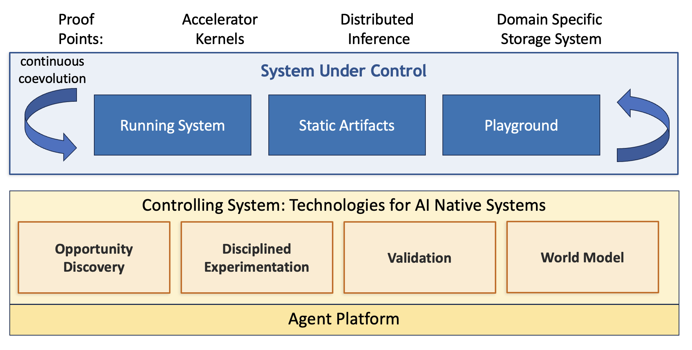

# AI-Native Systems, Six Months In: What We've Learned Building the Loop

*Tamar Eilam, Michael Factor, Shila Ofek-Koifman, Fabio Oliveira*

In April, we [introduced AI-Native Systems](https://ai-native-systems-research.github.io/ai-native-systems-research/blog/2026/04/21/ai-native-systems-autonomous-evolution-at-machine-speed/) as a bet: that a system's evolution, the whole loop from observing a problem to deploying a fix, could be driven primarily by AI, continuously, at machine speed, rather than mediated step-by-step by humans. We described that loop in terms of a **Reasoner** that observes and hypothesizes, and a **Changer** that plans and implements, operating over a **System Under Control**.

Since then we've built and run pieces of that loop against real systems: a distributed inference platform, a hyperspecialized storage engine, and compute kernels for accelerators. Based on that experience, we now have a better understanding of the principles behind building an AI-native system and what's actually required in practice to build such a system. This post is an update, not a reboot: we'll walk through a sharper, more concrete architecture, show with a concrete example how its pieces fit together, and share what we've learned over the past several months of work, including the parts that didn't work the first time.

If you read the April post, this picks up where it left off. If you didn't, this should stand on its own.

<!-- more -->

---

### The Updated Definition

We now define an AI-Native System as a complex software system that continuously and autonomously develops a **System Under Control** through four coordinated activities: **Opportunity Discovery**, **Disciplined Experimentation**, **Validation**, and a persistent **World Model**.  These activities  operate in a closed loop, with AI as the primary agent and humans defining constraints and objectives, to improve and specialize a system given its actual usage pattern.

The System Under Control itself has three components:

- **Running System** — config, logs, metrics, the live thing in production that is the source of business value.
- **Static Artifacts** — code, git history, specs, docs, requirements, policies, etc.
- **Playground** — test environments, simulators, tests, and the results of prior runs which enable evaluating proposed changes without affecting the live system.

What's changed from our initial view is the shape of the controlling loop itself. Our prior split between Reasoner and Changer was the right instinct but too coarse.
In practice, "observe and hypothesize" and "plan and implement" each split further once we tried to build them, and a third concern (does this actually work, and can we trust it?) needed to be first-class rather than implicit. So we now talk about four coordinated activities instead of two:

- **Opportunity Discovery** — given signals from the running system, experimentation, and validation; exogenous information such as articles and blogs; user feedback; and source code related artifacts, identify promising areas to investigate along with directional questions.
- **Disciplined Experimentation** — given a direction to investigate and guidance on how to evaluate it, follow a methodical process to reach the objective with justification for the chosen direction to enable explainability to humans and to the model for future improvements.
- **Validation** — establish metrics and benchmarks, check for regression-free improvement, detect drift, manage the playground, and keep the evaluation environment faithful to the real system and how it is being used.
- **World Model** — enable the other components to store and access over time both domain-specific knowledge and the principles the various components have discovered from a given deployment. Since principles stored are driven by results of experimentations, the main purpose of the World Model is to enable true and efficient co-evolution, rather than blind repetition and re-discovery.

Each of these is a generic mechanism whose behavior is parameterized by whatever System Under Control it's pointed at. The mechanism is shared, the content is domain-specific. World Model is the connective tissue: it's how the other three share what they've learned with each other, and with their future selves.

---

### Architecture, Made Concrete

Here's our current high-level conceptual architecture:

The System Under Control sits on top, shown here alongside three concrete proof points we'll come back to: accelerator kernels, a distributed inference stack, and a domain-specific storage system. Below it, the four activities operate on a shared agent platform.

- **Opportunity Discovery:** Given a whole codebase and a high-level repository-wide objective such as reduce latency,  it discovers what is worth optimizing: a specific code location (the **where**), a plain-English description of the opportunity (the **what**), one or more evidence-linked techniques to realize it (the **how**), and the signal that justified flagging it in the first place (the **why**). It fuses multiple kinds of signal to get there: behaviors surfaced from telemetry which can indicate anomolies or opportunities, findings surfaced from literature, and an understanding of the functions of the code.  It uses these signal to create a ranked, evidence-backed list of proposals which provide a starting point for downstream experimentation engines. It doesn't run the optimization itself but rather figures out what question we should be asking. There will be a blog, paper and publiclly available code in the near future for our implementatino of opportunity discovery.
- **Disciplined Experimentation:**  _Nous_ is our agentic research harness that applies the scientific method, generating and validating/disproving a set of hypotheses and building a pinciple-based understanding of the answer to a research question. In Nous a planning agent proposes testable hypotheses, an execution agent runs the experiments, and a principle store (the World Model) accumulates validated claims with confidence scores across iterations. We described Nous in more depth, with a concrete case study, in [this blog](https://ai-native-systems-research.github.io/ai-native-systems-research/blog/2026/06/17/can-an-agentic-harness-rediscover-the-insights-in-a-research-paper/).
- **Validation:** The validation component establishes the metrics and benchmarks a change is judged against, checks that a proposed change actually improves the target outcome without regressing something else, and keeps watch for drift between the assumptions a test harness was built under and the conditions actually present in production. In our work we have been able to automatically identify weaknesses in the evaluation used for evolving an algorithm in multiple published works. We are working towards making validation a reusable software component which we can share with the community.
- **The World Model:** A persistent, shared, evolving store of domain knowledge along with experiential knoweldge based upon a given deployment of the system is essential for progress. For instance, in the context of work on accelerator kernels, this could include a knowledge base of static information on the accelerator hardware along with information on what the system has learned in working with the code: what has worked, what has not worked, what are general principles, etc. We have seen the need for such a world model come up both from our use cases and from each of the other three controlling components.

#### How the pieces fit together

The architecture is easiest to understand end-to-end with a single walk-through. Take a concrete, representative case: a large language model serving system with a KV-cache that's evicting entries under either a least-recently-used or an adaptive replacement cache policy. The details of the example aren't important. What is important is given an objective such as reduce latency for serving system, how do we identify KV-cache evicition as an opportunity area; how do we improve the algorithm based on a princilped approach (explainable, efficient, safe); how do we ensure we have not gone too far in specializing the system; and how does the AI-native system "learn" from this effort.

1. **Discovery.** We point the oportunity discovery component at the whole repository with a general objective, reduce latency, with no indication about where to look. In the context of the codebase, it fuses two signals: a telemetry anomaly (the cache's hit rate under memory pressure is far below a healthy baseline) and an academic literature finding (a cache-eviction technique not present in codebase and unrelated to this project, that addresses exactly this kind of skew). Where both signals agree, it proposes a ranked, evidence-linked target: replace the eviction policy at this specific location, a possible approach to take, and a reasoned hypothesis on why it should work.
2. **Experimentation.** That proposal is hoisted, unmodified, to Nous. Nous turns "replace the eviction policy" into a testable hypothesis along with a series of sub-hypothesis, termed arms.  It then runs a series of experiments implementing the change, exercising it against representative workloads and tracking the outcome with a confidence score rather than a single pass/fail.  It uses the results of these experiments to build knowledge about the system and curate a set of principles.
3. **Validation.** Before anything is trusted, it has to survive more than the metric it was optimized against. Does the change actually improve the target outcome without quietly breaking something else: throughput, tail latency, a different workload shape than the one it was tuned on? Would the same metric reward a change that technically scores well but behaves badly? For instance, a policy that scores great in a simulator but crashes the real system, or a policy that games a benchmark without actually helping the thing the benchmark was a proxy for? This is where a change earns (or fails to earn) the right to matter.
4. **Persistence.** Whatever happened — a validated win, a regression, a metric that turned out to be gameable — is written back to the World Model. The next time Discovery or Experimentation touches this system, it starts from that accumulated understanding instead of from zero.

This is, deliberately, an idealized pass. Some of these elements are live and integrated today; others are still partial.  We're describing the target shape of the loop, not claiming it's fully closed.  We have internally shown how we can identify the opportunity we describe above and hand off to Nous to generate a code change.  In our evaluation environment this led to a 30% improvement in overall latency. We still have work to in integrating automated validation and providing a unified world model but we have made much progress and learned much since we started out journey. This brings us to the next section: What have we learned in this journey? 

---

### Lessons Learned

Pointing this loop at real systems has taught us way more than any architecture diagram could ever teach. A few things stood out enough to be worth sharing:

- **Search needs guardrails, or it goes looking in the wrong place.**  Left unconstrained, automated exploration is prone to a kind of wild-goose chase, chasing configurations or code paths that are technically valid to explore but practically irrelevant. 
- **Models have a bias against non-typical solutions.** This surprised us. When the internet's dominant advice for a problem is one particular architecture, models default to it even when a less-discussed but faster approach exists and is well-documented, just less popular. We saw this directly in storage work: the internet is full of GPUDirect-capable storage systems advertising bounce-buffer designs, and models defaulted to that pattern even though a peer-to-peer (P2P) approach — less commonly discussed, but well documented — is sometimes faster.
- **A cost-efficient evaluation testbed, a simulator or equivalent, is often what makes the experimentation phase viable at all.** Standing up and configuring the infrastructure to evaluate changes on a real system is frequently cost-prohibitive: real clusters, real accelerators, real production-like load. This isn't the case for every domain. Optimizing a standalone algorithm like circle packing, a favorite target in papers on LLM-driven evolution, needs nothing more than a laptop, but for the systems we care about, a fast, cheap stand-in for the real thing is often the difference between running thousands of experiments and running a handful.  This is why we built [BLIS](https://llm-d.ai/blog/blis-evolving-llm-d-at-simulation-speed) for use with our distributed inference use case.  But in general, this will lead to the question of where does the simulator come from?
- **The sim-to-real gap is real, and it's usually the thing that actually limits you.** A change that looks good in a simulator or against a proxy metric doesn't automatically survive contact with the real system. Evolved policies eventually have to pass a real, wall-clock test on real infrastructure, and simulator error, particularly around saturation behavior, is often the limiting factor. Infrastructure flakiness (GPU/device and driver issues, especially in disaggregated or auto-scaled setups) makes this worse: it undermines the repeatability that both experimentation and validation depend on.
- **Specs as ground truth, and clear component boundaries, keep the system (and the humans) from losing the plot.** Even with careful iterative development between domain experts and AI, it's surprisingly easy to lose the mental model of a system's architecture as change accelerates. Treating specifications as the actual source of truth — and using AI itself to derive architectural artifacts like flow charts and component diagrams from that ground truth — helps considerably. So does a component-based architecture with clear interface boundaries: it limits blast radius and keeps the scope of any change small enough to reason about.  Until we get to the vision of fully autonomous evolution at machine speed, human understandability is critical.
- **Harnesses matter.** In particular, we showed that a structured compound hypothesis, whose constituent arms systematically explore ablations and isolate the load-bearing mechanism, together with a structured evaluation that measures both the magnitude and direction of observed changes, improves not only explainability but also the quality of AI reasoning, leading to more efficient and targeted exploration of the iterative search space.

---

### Where This Is Headed

This post is the connective update, the architecture and some of what we have learned, not the deep technical detail. More posts and deeper technical papers are coming that go deep on the pieces we've only sketched here: the team is writing a dedicated post and paper on Opportunity Discovery, and we'll follow with more on how we're approaching validation and the shared world model as this loop matures.

A few months ago this was our vision: AI as the primary agent of a system's evolution, with humans focused on goals, constraints, and trust. It's still that. What's changed is that we're no longer describing a loop we intend to build.  We are describing our progress against real systems, and reporting back what happened when we did. The next posts will go deeper into each piece as well as other use cases.
