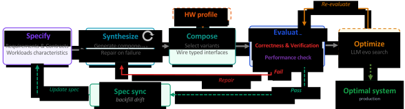
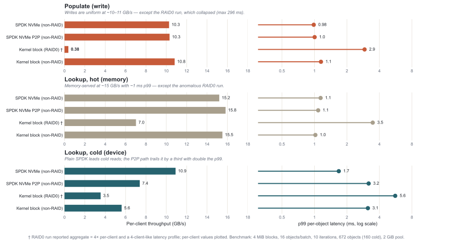
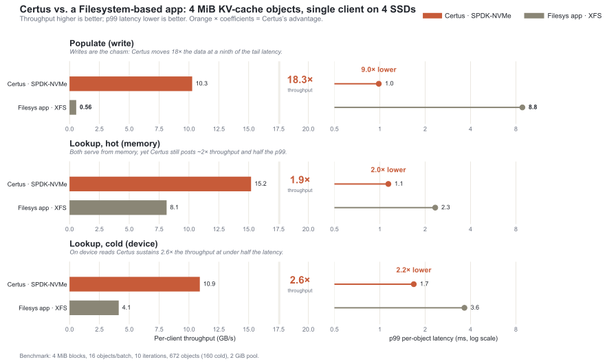

# Certus: The End of One-Size-Fits-All Storage

> What if a storage system tailored to your exact workload could be *generated* in days rather than hand-built over years? **Certus** explores that question—using AI Native Systems techniques to synthesize hyper-specialized storage engines from specifications.

## The Cost of Generality

Every time you read from or write to a storage system, you are paying a tax you never explicitly agreed to—the tax of generality. The storage systems that underpin modern infrastructure are marvels of engineering, but they are engineered to serve everyone. And in serving everyone equally, they serve no one optimally.

This is not a new observation. Systems researchers have long known that purpose-built storage—a storage system designed for exactly one workload—can outperform general-purpose alternatives by orders of magnitude. The question has never been whether specialization *works*. The question has been whether specialization is *affordable*.  Building a storage system is expensive. Maintaining it across hardware generations is more expensive still. Specializing it for a single workload, and then re-specializing it as that workload evolves, has historically been a cost that only the largest organizations could absorb—and even then, only rarely.

A recent [post](https://ai-native-systems-research.github.io/ai-native-systems-research/blog/2026/04/21/ai-native-systems-autonomous-evolution-at-machine-speed/) on this blog argued that AI Native Systems, software that closes the loop from observation to reasoning to change to validation autonomously, represent a fundamental shift in how software evolves. Certus is that vision applied to storage: a system that synthesizes hyper-specialized storage engines from specifications rather than building them by hand, thus directly addressing the affordability challenge.

> **The central wager of Certus:** if you can *generate* a specialized storage system rather than build one by hand, the economics of specialization change entirely.

To ground the idea concretely, Certus targets one of the most demanding and rapidly evolving storage workloads in modern AI infrastructure: the **KV-Cache for Large Language Model (LLM) inference**.

In this blog we share our initial experiences using an AI Native Systems approach to create Certus, given an overview of the tools and techniques we have used, share preliminary performance results, and discuss the broader implications for hyper-specializing complex systems such as storage systems.

## The KV-Cache Workload: A Case Study

When a large language model processes a prompt, every layer of the transformer computes a set of KV tensors representing its attention state. For long contexts or multi-turn conversations, recomputing these tensors on every request is both redundant and expensive. A KV-Cache solves this by storing tensors after the first computation and retrieving them on subsequent requests that share the same prompt prefix—avoiding redundant work and reducing inference latency. These tensors are indexed and retrieved based upon a hash of the values which created the KV pair. Specializing the KV-cache based upon workload characteristics can significantly reward hyper-specialization, making it an ideal early proof-point for the AI Native Systems approach.

The requirements of the KV-cache workload are not aligned with the characteristics of a general-purpose storage system:

- **Data is identified by a key**—each piece of data mapped to a 64-bit fixed length key. There is no value in providing string-based naming and hierarchical directory structures that a conventional filesystem offers.
- **Write-once, then read-many**—large tensor blobs (typically 4–5 MiB) are written in a single burst at the end of the pre-fill phase, then never modified. Subsequent accesses are read-only.
- **Relaxed durability**—lost entries are not catastrophic (as long as the loss is detected); they can be recomputed at the cost of latency and compute. This makes strict persistence unnecessary and opens up design space unavailable to general-purpose stores.
- **Latency-sensitive reads**—a cache miss stalls inference and forces re-computation, directly degrading user-facing response time and throughput.
- **Fixed, predictable object sizes**—unlike general-purpose caches that must handle arbitrary payloads, KV entry size is determined entirely by model architecture and is known at system generation time.
- **Highly skewed access distribution**—shared prompt prefixes cause a small fraction of entries to dominate reads. The access pattern is not uniform and not random; pre-fetching is viable.

No general-purpose storage system is a natural fit for this profile. The combination of write-once semantics, relaxed durability, fixed object sizes, and skewed access patterns creates an opportunity for aggressive specialization—one that Certus exploits. 

## Why Specialization Has Always Been Out of Reach

The case for a purpose-built KV-Cache store is not hypothetical—3FS[<a href="#ref-1">1</a>] and Mooncake[<a href="#ref-2">2</a>] prove the performance argument. But both required substantial engineering investment to produce, and neither is easily adapted to different hardware targets or workload variants. The unanswered question is not whether to specialize, but how to make specialization *repeatable at low cost*.

Storage systems are among the most complex artifacts in systems software. A production-grade storage engine must correctly handle concurrent access, crash recovery, memory pressure, I/O scheduling, indexing, serialization format, and dozens of other concerns—all simultaneously, all without data loss. The effort required to build storage systems creates a strong forcing function toward generality. If you are going to spend that much effort, you want the system to be useful for as many workloads as possible. Specialization is a luxury that only makes sense when the performance gains justify maintaining a separate code-base for each target workload.

For most organizations and most workloads, that bar is never cleared. The result is a storage landscape dominated by a small number of general-purpose systems that everyone uses, regardless of fit.  AI Native Systems change this calculus. 

## Certus—Applying AI Native Systems to Storage Solutions

Certus combines four interlocking techniques to make specialization tractable: (1) *specifying* desired behavior and workload characteristics, (2) *synthesizing and composing* components into a holistic system, (3) *evaluating* correctness and performance on target hardware, and (4) *optimizing* via evolutionary search for the best-performing implementation. Together these techniques make hardware adaptability a consequence of the approach rather than a separate engineering effort. Throughout, Certus leverages LLM-based agentic coding—including Claude, Codex, Copilot, and IBM Bob—as the engine driving synthesis and optimization. The integration of these techniques is defined in the *adaptation cycle* shown in [Figure 1](#fig-methodology_overview).

<figure markdown id="fig-methodology_overview">
  
  <figcaption>Figure 1: The Certus adaptation cycle. Workload requirements and hardware characteristics drive specification, synthesis, composition, evaluation, and optimization. Different targets produce structurally different systems from the same adaptive process.</figcaption>
</figure>

### Spec-Driven Development: Describing Systems Behavior Rather Than Writing Code

The foundation of Certus is LLM-based program synthesis using Spec-Driven Development (SDD)—the idea that program code can be synthesized from a natural language-based requirements specification rather than being authored line by line.  In Certus, each deployment is a custom composition of artifacts selected according to the workload and deployment environment, performance constraints, durability requirements, and available hardware.  Given the appropriate specifications, a concrete implementation is synthesized, which comprises a tailored composition of pre-built and newly synthesized components as needed. The specification covers both individual components and the overall system composition—defining which components are selected and how their typed interfaces are wired together for a given deployment target.

Certus uses Spec Kit[^1], an open-source toolkit that operationalizes SDD. Rather than treating specifications as scaffolding to be discarded once implementation begins, Spec Kit makes them the primary artifact from which working implementations are derived.  In addition to forward generation, specifications can be “back-filled” to align with code changes made outside the normal flow.  

In practice, Spec Kit provides an agent-driven workflow: establish project principles, define what you want to build in natural language, iteratively clarify gaps, generate a technical plan, and execute synthesis. The result is a repeatable process that shifts developer effort from writing implementations to refining specifications—with the implementation following as a consequence.

This is not templating. The synthesized systems differ structurally based on the specifications. The productivity gain is significant, but the more important effect is structural: program synthesis decouples the cost of building a system from the cost of specializing it. Once the generator exists, producing a new specialized variant costs approximately as much as modifying a specification—not as much as writing its implementation.

### Component-Based Composition: A Vocabulary for Storage Systems

Program synthesis needs a substrate to generate into. Given a requirements specification, the Certus synthesis layer generates the components needed to realize it—producing new building blocks when none exist, or selecting and adapting previously verified components from a growing library. Each component exposes a typed *interface* that defines the functions it provides, as well as one or more *receptacles*—required interfaces that must be satisfied by other components—that define what the component depends on. The synthesis layer reasons about compatibility, resource availability, and performance implications when generating or selecting components. 

Component-based composition solves a practical problem in system synthesis: generating correct, efficient low-level code from high-level descriptions is hard. By generating compositions of proven components rather than raw code, Certus inherits the correctness and performance properties of the component library.  This means that the coding agent's inferencing context can be limited to a system-wide view that abstracts over the details of internal component implementations. When evaluation reveals a correctness failure or performance mismatch, the synthesis layer is re-invoked with the failure report and original specification, generating a corrected component before re-entering the evaluation.

Synthesized components are not useful in isolation—they must be assembled into a holistic system. The Certus composition layer selects component variants and wires their typed interfaces together according to the requirements specification and the hardware profile, producing a complete, deployment-ready system.

<figure markdown id="fig-architecture">
  
  <figcaption>Figure 2: Certus baseline architecture. Solid borders denote 
synthesized components. The SPDK NVMe block-device driver delivers zero-copy DMA transfers directly from GPU VRAM to NVMe; alternative drivers are selected at system-generation time.</figcaption>
</figure>

[Figure 2](#fig-architecture) shows the baseline Certus architecture produced from the KV-cache specification. From left to right: gRPC requests arrive at the Dispatcher, where keys are resolved against the Dispatch Map and routed to one of *N* storage shards or served directly from the Memory Tier on a cache hit. Each shard contains an Extent Manager that handles NVMe space allocation; the Dispatcher's background threads drain the Memory Tier to SSD asynchronously and evict entries when capacity thresholds are exceeded. At the hardware boundary, the Block-Device Driver delivers zero-copy DMA transfers directly from GPU VRAM to NVMe when backed by SPDK NVMe—an architectural source of Certus's performance advantage over conventional filesystem back-ends.

The ultimate aim is to provide a “smorgasbord” of re-usable and tuneable components that offer different capabilities.  For example, Certus supports multiple block-device driver back-ends that have different dependencies on the deployment.  If NVMe SSDs are available and do not need to share data with other applications, an SPDK-based solution that provides optimal performance may be used.  Alternatively, in a virtual machine deployment scenario, a kernel block device might be the best option. [Section 2](#sec-results) quantifies the impact of block-device component selection on end-to-end performance.

### Synthesized Formal Verification: Proving What You Generate

Synthesized code carries a risk that hand-written code shares: correctness is assumed until something breaks in production.  The most widely used strategy to eliminating program bugs, is to integrate extensive unit and integration run-time tests into the development pipeline.  These tests are generated by Certus using both the Spec Kit specifications and the synthesized code.  Given that it would be impossible to run and check all parameter combinations, these tests verify basic behavior for only a fixed set of parameters (usually random points and boundary conditions).

Certus goes further by applying formal verification techniques that can identify errors that run-time testing cannot.  The Certus development pipeline **generates verification artifacts alongside the implementation**—the formal proof of correctness is produced at the same time as the code it certifies, by a dedicated verification agent operating on the same specification.

Different classes of correctness properties require different verification techniques. In addition to the typical suite of correctness tests, Certus currently applies three complementary tools, each targeting a distinct layer of the correctness argument:

- **Kani** [<a href="#ref-3">3</a>] — a bit-precise model checker for Rust developed at AWS. Kani translates Rust code into a form that SAT/SMT solvers can reason about exhaustively across all possible inputs.
- **Creusot** [<a href="#ref-4">4</a>] — a deductive verifier for Rust developed at INRIA. Creusot verifies functional correctness: that implementations conform to their formal specifications.
- **Spin** [<a href="#ref-5">5</a>] — a model checker for concurrent systems that checks all possible interleavings do not result in dead-lock or live-lock conditions.

**Verification as a Pipeline**

The three tools form a pipeline, not alternatives. Spin verifies concurrency of control flow and threading. Kani verifies the synthesized Rust against low-level safety properties. Creusot verifies the core algorithms against their functional specifications (from Spec Kit). Each tool operates at the level it is suited for; together they cover a broader correctness argument.

Together, spec-driven development and generative formal verification invert the usual correctness argument for generated code. The common objection to synthesized systems is that they are opaque and hard to trust. In Certus, the generated code comes with a **formal certificate of correctness**—verified at the protocol level by Spin, at the implementation level by Kani, and at the algorithmic level by Creusot. A generated system with verified specs at all three levels is, in a meaningful sense, more trustworthy than a hand-written system without any of them.

### Evolutionary Frameworks: Searching for the Best System
 
Specification and composition define what Certus can generate, but not necessarily the best-performing variant for a given deployment. 
Evolutionary optimization searches that design space for high-performing implementations. Once a component's interface contract is established, the performance-critical code within it—buffer management strategies, I/O scheduling policies, concurrency patterns, and memory hierarchy decisions—forms a large interacting parameter space. The optimal choice depends on hardware topology and workload characteristics, such as data access patterns, read/write ratios, object sizes, and concurrency levels, and often cannot be derived analytically. This is where evolutionary search excels.

Certus draws on a rapidly maturing ecosystem of LLM-guided program evolution[<a href="#ref-6">6</a>, <a href="#ref-7">7</a>, <a href="#ref-8">8</a>, <a href="#ref-9">9</a>, <a href="#ref-10">10</a>, <a href="#ref-11">11</a>], where populations of code variants are scored against target benchmarks. Complementary reflective approaches refine candidates by diagnosing failures[<a href="#ref-12">12</a>] or by building world models of hypotheses to guide the search[<a href="#ref-13">13</a>]. Beyond evolutionary frameworks, Certus also leverages agentic coding sessions and hypothesis-driven controlled experiments[<a href="#ref-14">14</a>] for tasks requiring cross-file reasoning or causal diagnosis.

Applying these frameworks to multi-module systems code with hardware-specific APIs and interacting resource constraints requires additional guardrails. Without constraints, LLM-proposed candidates waste evaluation cycles in two ways: they fail to compile because they reference incorrect or nonexistent APIs—wrong function signatures, invalid module paths, or hallucinated symbols—or they compile but crash at runtime when independently tuned parameters exceed available memory, for example when large buffers are multiplied across many concurrent queues. Certus prunes such infeasible candidates early using two guardrails. First, API surface extraction scans target files for exact `use` import paths and `pub fn` signatures, ensuring generated code references real modules, types, and functions. Second, hardware profiling injects measured limits—including NVMe bandwidth, PCIe topology, and memory budgets—so the search can reject candidates whose parameters exceed physical hardware limits.

These guardrails also make the optimization loop portable across deployments. When hardware changes—a different NVMe generation, a different PCIe topology, or a different memory hierarchy—the profile is refreshed and the search is re-run, potentially producing a different eviction policy, buffer strategy, or concurrency model. This turns hardware variation from a manual redesign problem into an input to the Certus optimization process.

### Hardware Adaptability: A Strategic Advantage

The LLM-driven approach has an implication beyond any single workload: it makes adaptation to new hardware dramatically faster. In conventional storage development, adapting to new hardware means:

1. Identifying the performance-critical assumptions embedded in the existing codebase
2. Understanding how new hardware invalidates those assumptions
3. Redesigning the affected subsystems
4. Re-implementing and re-testing
5. Validating that changes do not regress existing workloads

This process can take years for a mature storage system, ultimately thwarting the adoption of new hardware capabilities.  In Certus, an agent extracts hardware characteristics from deployment environments (e.g., max SSD read/write bandwidth, GPU H2D transfer rates, network topology).  Adapting to new hardware means updating the hardware description in the spec and re-running the generative framework. The evolutionary frameworks re-optimize for the new hardware characteristics—discovering, for example, that a different thread topology or queue depth is optimal when NVMe bandwidth or PCIe topology changes. A new specialized system emerges in days, not years.

## Early Results

### Component Selection: Block Device Back-Ends

Certus supports multiple block-device driver back-ends with different deployment dependencies. [Figure 3](#fig-block_device_comp) compares four configurations across the populate (adding a new cache value), hot-lookup (a lookup when the object is in the memory-tier), and cold-read phases (a lookup when the object is in the SSD-tier).

<figure markdown id="fig-block_device_comp">
  
  <figcaption>Figure 3: Comparison of different block-device components on Certus API performance.</figcaption>
</figure>

The comparison shows that SPDK-based back-ends dominate cold reads (10.9 GB/s vs. 5.6 GB/s for a single kernel device), while all paths perform comparably on writes and hot lookups—illustrating how component selection creates meaningful performance differentiation only where the workload stresses the storage path. This demonstrates the value of our component-based design whereby a system is composed from a collection of components according to the requirements of the deployment environment.

### End-to-End: Certus vs. Filesystem Baseline

[Figure 4](#fig-certus_vs_mockup) compares Certus against a generalized filesystem baseline: XFS mounted on a software RAID-0 array, using file naming to map keys to cached data. The Certus solution exploits SPDK-based NVMe with zero-copy DMA transfers. The data is for a single client with 4x SSD devices.

<figure markdown id="fig-certus_vs_mockup">
  
  <figcaption>Figure 4: Comparison of generalized filesystem vs. Certus custom storage system</figcaption>
</figure>

Certus offers the best performance for every phase. The gap is most significant on writes—18.3× the throughput (10.3 vs 0.56 GB/s) at 9× lower tail latency—because the filesystem path requires extensive per-object metadata (stored in inodes), additional memory copies (e.g. user memory to kernel DNA-ready memory), WAL journaling, and fine-grained allocation costs that Certus bypasses. On reads the advantage is still substantial: 1.9× throughput on hot lookups and 2.6× on cold, each with approximately half the p99 latency.

## Broader Implications

KV-Cache is a demanding target, but it is not the only workload that would benefit from hyper-specialization. Any storage workload with a stable, well-understood I/O profile is a candidate:

- Time-series stores for telemetry ingestion
- Low-latency stores for interactive workloads
- Write-optimized stores for logging pipelines
- Read-optimized stores for ML feature serving
- Append-only stores for event streaming

The common thread is not the domain but the **specificity**: the clearer and more stable the workload, the more aggressively the generator can specialize.  The practical consequence is straightforward: even a 2× throughput improvement translates directly into fewer servers provisioned, lower energy consumed per request, and tighter tail latencies that users experience as faster responses. When specialization is cheap enough to be routine, organizations no longer choose between cost efficiency and workload fit—they get both.  The deeper shift is a change in what storage system and maybe broader systems development *means*. Conventionally, building a storage system means writing an implementation. In the Certus model, it means writing a specification—and the implementation follows as a consequence. When the path from “here is my workload and hardware” to “here is a verified, optimized storage system” can be traversed in days rather than years, **specialization becomes the default** rather than the exception.

The deeper questions—how far the component vocabulary can scale, how generated systems should be versioned as workloads shift, and what workloads are too dynamic for a static spec—are ones Certus is actively confronting. The KV-Cache store demonstrates the approach on a workload that is both practically important and analytically tractable; the synthesis framework, the component library, and the verification pipeline are all early-stage artifacts with known limitations. We will return to these open questions as the system matures.

Certus is an open-source project which can be found at:

<https://github.com/AI-native-Systems-Research/ai-native-storage-certus>

*Certus is active research at IBM. Feedback and collaboration are welcome.*

Please contact us at <ai-native-storage@ibm.com>

[^1]: <https://github.com/github/spec-kit>

---

## References

[1] DeepSeek. *3FS: A High-Performance Distributed File System for AI Training and Inference Workloads.* GitHub, 2025. <https://github.com/deepseek-ai/3FS>

[2] R. Qin et al. *Mooncake: A KVCache-centric Disaggregated Architecture for LLM Serving.* Moonshot AI, 2024. Best Paper Award, FAST 2025. <https://arxiv.org/abs/2407.00079>

[3] A. VanHattum et al. *Verifying Dynamic Trait Objects in Rust.* ICSE 2022. <https://github.com/model-checking/kani>

[4] X. Denis, J.-H. Jourdan, C. Marché. *Creusot: A Foundry for the Deductive Verification of Rust Programs.* ICFEM 2022. <https://github.com/creusot-rs/creusot>

[5] G. J. Holzmann. *The SPIN Model Checker.* Addison-Wesley, 2003. <https://spinroot.com/>

[6] B. Romera-Paredes et al. *Mathematical discoveries from program search with large language models.* Nature, 2024. <https://doi.org/10.1038/s41586-023-06924-6>

[7] A. Novikov et al. *AlphaEvolve: A coding agent for scientific and algorithmic discovery.* Google DeepMind, 2025. <https://deepmind.google/discover/blog/alphaevolve-a-gemini-powered-coding-agent-for-designing-advanced-algorithms/>

[8] D. Sharma. *OpenEvolve: An open-source implementation of AlphaEvolve.* 2025. <https://github.com/algorithmicsuperintelligence/openevolve>

[9] R. T. Lange, Y. Imajuku, E. Cetin. *ShinkaEvolve: Towards Open-Ended and Sample-Efficient Program Evolution.* arXiv:2509.19349, 2025. Sakana AI. <https://arxiv.org/abs/2509.19349>

[10] S. Agarwal et al. *AdaEvolve: Adaptive LLM Driven Zeroth-Order Optimization.* arXiv:2602.20133, 2026. <https://arxiv.org/abs/2602.20133>

[11] S. Agarwal et al. *SkyDiscover: A Flexible Framework for AI-Driven Scientific and Algorithmic Discovery.* UC Berkeley Sky Lab, 2026. <https://github.com/skydiscover-ai/skydiscover>

[12] A. Singhvi et al. *GEPA: Reflective prompt evolution can outperform reinforcement learning.* ICLR 2026 (Oral). arXiv:2507.19457.

[13] S. Cao et al. *K-Search: LLM Kernel Generation via Co-Evolving Intrinsic World Model.* arXiv:2602.19128, 2026. <https://arxiv.org/abs/2602.19128>

[14] *Nous: Hypothesis-Driven Experimentation for Software Systems.*
IBM Research, 2026.
<https://github.com/AI-native-Systems-Research/agentic-strategy-evolution>
