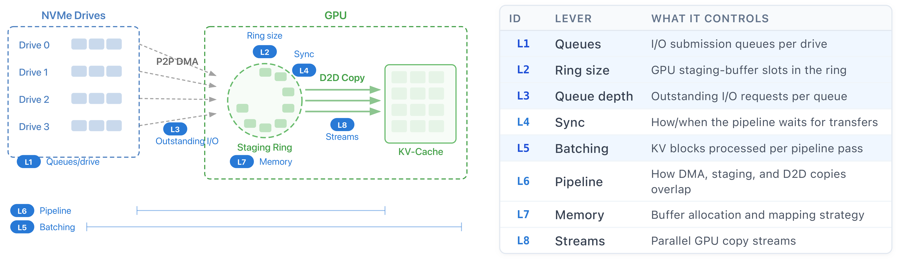
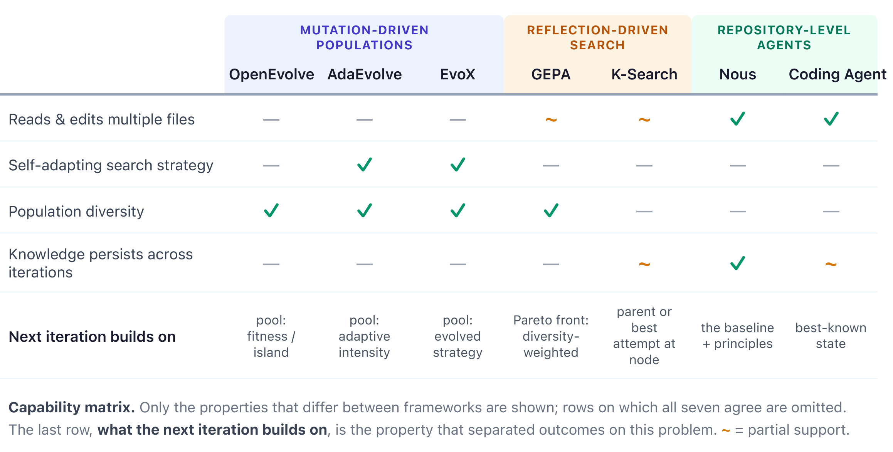
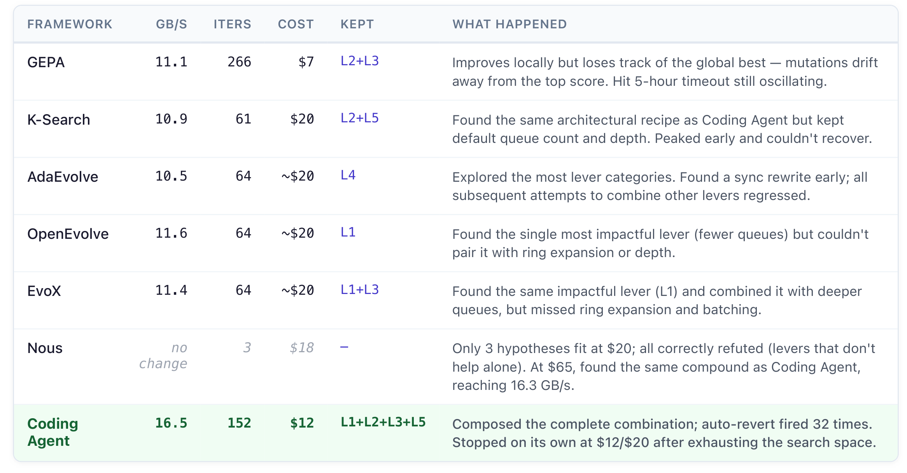
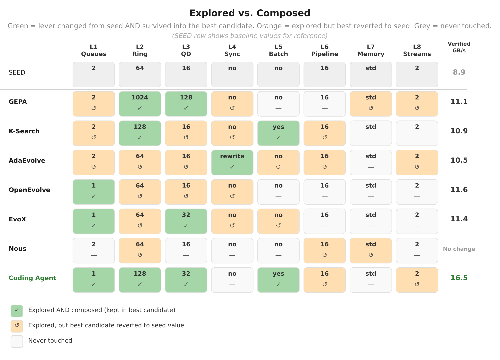
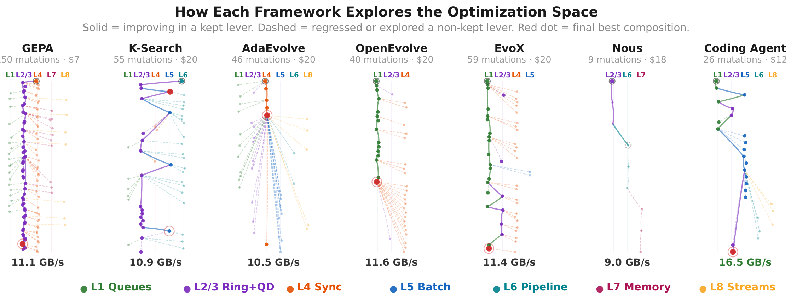

# Discovery Is Easy, Composition Is Hard

Why LLM Optimizers Find the Right Answers But Can't Assemble Them 
Case Study I: The Certus Cold-Read Path

This is the first in a series of case studies applying AI-driven optimization to [Certus](https://ai-native-systems-research.github.io/ai-native-systems-research/blog/2026/06/17/certus-the-end-of-one-size-fits-all-storage/), a hyper-specialized storage system for LLM inference and KV-cache workloads. We gave six LLM-driven code optimization frameworks and one coding agent the same task: speed up Certus's *cold-read path*, the performance-critical path for retrieving cached KV blocks from NVMe storage to GPU memory.

<!-- more -->

Six of seven improved throughput over the 8.86 GB/s baseline, but five plateaued between 10.5–11.6 GB/s.  Under the shared $20 budget, only one broke through to 16.5 GB/s—an
86% improvement—by assembling the complete combination of changes.

That gap between finding the right answers and assembling them into faster code is what we call the **composition barrier**. The best configuration can sit behind intermediate states that look worse than the current best. If a framework can't tolerate intermediate regressions, it gets stuck — even when it has already found the pieces of the answer.

## The Problem

When a KV-cache block is not resident in GPU or CPU memory, [Certus](https://ai-native-systems-research.github.io/ai-native-systems-research/blog/2026/06/17/certus-the-end-of-one-size-fits-all-storage/) retrieves it from NVMe SSD. We asked each optimizer to **improve the existing peer-to-peer (P2P) transfer path on four drives** — bypassing host DRAM and transferring directly from NVMe into GPU memory. The baseline delivers 8.86 GB/s — only 42% of the 21.1 GB/s hardware ceiling.

The P2P pipeline ([Figure 1](#fig-architecture)) reads from multiple drives in parallel into a GPU staging ring, which copies data into its final KV-cache region. Across all runs, the optimizers changed the same eight parts of this pipeline (L1–L8). These *levers* interact — queue count affects queue depth utilization, queue depth affects staging-ring pressure, and batching changes how much work stays in flight — so changing one lever in isolation can regress performance even when it is part of the optimal combination.

<figure markdown id="fig-architecture">
  
  <figcaption>Figure 1: The P2P cold-read pipeline and its eight optimization levers (L1–L8). The largest gain appears only when L1–L3 are combined with the structural batching change, L5 (highlighted).</figcaption>
</figure>

## The Seven Optimizers

There are now several tools that use LLMs to iteratively improve code against a benchmark. They differ in what drives each new candidate change, and in what it builds on ([Figure 2](#fig-capabilities)).

<figure markdown id="fig-capabilities">
  
  <figcaption>Figure 2: <strong>Capability matrix.</strong></figcaption>
</figure>

**Mutation-driven populations ([OpenEvolve](https://github.com/algorithmicsuperintelligence/openevolve), [AdaEvolve](https://arxiv.org/abs/2602.20133), [EvoX](https://arxiv.org/abs/2602.23413)).** These keep a pool of candidates and mutate them; each iteration produces a whole new program. They differ in how the pool is managed. OpenEvolve samples from an archive (exploit) or random island members (explore); AdaEvolve shifts search intensity from an accumulated improvement signal, with bandit-scheduled islands and stagnation-triggered strategy shifts; EvoX co-evolves the search strategy itself. In all three the next mutation is drawn from the pool by fitness or diversity.

**Reflection-driven search ([GEPA](https://github.com/gepa-ai/gepa), [K-Search](https://github.com/caoshiyi/K-Search)).** Both reason explicitly about *why* a candidate failed before proposing the next one, but over different structures. GEPA is also population-based: it reflects on execution traces and accepts candidates that improve the Pareto front, then picks the next parent from a diversity-weighted pool (frequency across validation subsets). K-Search maintains a “world model” and plans before generating code, picking its next move from an open frontier that spans the whole decision tree and extending whichever node it selects.

**Repository-level agents ([Nous](https://github.com/AI-native-Systems-Research/agentic-strategy-evolution), Coding Agent).**
These get the whole repository and real developer tools. The Coding Agent reads, edits, and benchmarks in a loop, prompted only to maximize performance, with past scores and edits injected after each evaluation; after consecutive regressions, it auto-reverts to the best-known state. Nous instead runs controlled experiments to determine why a change works: an explicit design phase reasons about what to try, then each experimental round evaluates a bundle of hypotheses and ablations against an unmodified copy of the code. Only the extracted principles persist to guide the next round.

*All used Claude Sonnet 4-6 for code generation; Nous additionally used Opus 4-6 for hypothesis design. For tools that can't edit across files, we concatenate the target source into one block and split edits back for compilation.*

## What Happened

We gave each framework a $20 budget and a 5-hour wall clock; every mutation was built, benchmarked, and integrity-checked. Across runs, the frameworks discovered overlapping optimizations, which we categorize into eight levers (L1–L8) in [Figure 1](#fig-architecture).

Exploration was not the hard part. The hard part was holding multiple changes together when some look worse until the full combination pays off — the **composition barrier**.

**The winning compound** required fewer but deeper queues (L1+L3), a larger staging ring (L2), and batching to keep them all fed (L5). Most frameworks found subsets of these levers and plateaued at 10.5–11.6 GB/s ([Figure 3](#tab-results) and [Figure 4](#fig-explored_vs_composed)); only the Coding Agent retained all four and reached 16.5 GB/s.

<figure markdown id="tab-results">
  
  <figcaption>Figure 3: Per-framework results (verified throughput). Baseline 8.86 GB/s.</figcaption>
</figure>

**Why the gap exists.** The levers are mutually dependent. On the baseline configuration, batching (L5) alone reduces throughput by 9.5% because the existing queue and ring settings cannot exploit it, while changing the queue parameters without batching yields only modest gains. Throughput reaches 16.5 GB/s only when L5 is combined with parameters tuned for the batched regime (L1+L2+L3). Thus no incremental ordering delivers continuous progress: after any single lever is applied, the next lever either regresses or leaves throughput unchanged until the full compound is assembled.

On this landscape, a framework that cannot return to the best-known state after a regression is unlikely to obtain a clean attempt at the full compound ([Figure 4](#fig-explored_vs_composed)): a regressing candidate may be deprioritized as a parent (population tools), displaced by diversity-driven selection (GEPA), or passed over when the next attempt starts from a different node (K-Search).

 

The **exploration trees** ([Figure 5](#fig-exploration_tree)) show why each framework got stuck. The population-based tools (OpenEvolve, AdaEvolve, EvoX) explored broadly, but selection pressure sidelined regressing candidates before they could be combined — AdaEvolve, the most adaptive of the three, explored the most lever categories yet plateaued with the rest. GEPA selected parents from across its Pareto front, weighted by how many validation subsets each candidate led on, which pulled subsequent mutations away from the single best-scoring candidate. K-Search found the correct structure — its best candidate kept both batching and the larger ring — but never combined it with the queue changes that make batching pay, reverting L1 and L3 to their seed values. The Coding Agent's tree is sparse (26 mutations) but reaches the highest point.

 

<figure markdown id="fig-explored_vs_composed">
  
  <figcaption>Figure 4: <strong>Explored vs. composed.</strong> Green = lever changed from seed AND kept in best candidate. Orange = explored but best candidate reverted to seed. Grey = never touched.</figcaption>
</figure>

<figure markdown id="fig-exploration_tree">
  
  <figcaption>Figure 5: <strong>Exploration trees.</strong> Shows code-changing mutations. Time flows top to bottom.</figcaption>
</figure>

**Recoverability was the differentiator.** The Coding Agent reverts only after *consecutive* regressions, allowing one worse result to persist long enough for a complementary change to make it pay off; if the branch still fails, the files return to the best-known state. Merely retaining the best candidate in a pool is not enough—the search must reliably resume from it.

In a separate $65 run, [Nous](https://github.com/AI-native-Systems-Research/agentic-strategy-evolution) reached the same compound independently (16.3 GB/s) by a different route entirely: controlled experiments that reset each time, carrying forward extracted principles rather than a retained code state. Under the $20 budget, Nous completed only three experiments and did not reach the compound, suggesting that its limitation in this setting was budget rather than method. Nous also produces an artifact that the Coding Agent does not: an explicit set of learned principles that can be accumulated into a reusable knowledge base.

**Is 16.5 GB/s the best possible?** Not necessarily: the 21.1 GB/s hardware ceiling leaves 22% unclaimed. Whether software can close that gap is an open question.

## What We Learned

Systems code can have **composition barriers**: useful changes look ineffective or harmful until the rest of the combination is present. **Finding individual optimizations was easy. Combining them was not.**

The difference between discovering an optimization and composing it came down to the *harness* — not the model, but the infrastructure around it. Given that composition barriers exist, three factors determine whether a framework can cross them:

1. **Recoverability enables composition.** A framework needs slack to tolerate temporary regressions, plus a reliable restart from the best-known state when they do not pay off.
2. **Composition can come from volume or targeting.** Many low-cost iterations give more chances to cross the barrier; a few higher-cost experiments can work instead when upfront design decides what each attempt tests.
3. **Guardrails make autonomous optimization safe.** Data-integrity checks catch silent corruption (e.g., reusing a buffer before an async transfer completes). A hardware ceiling rejects impossible results.

This is a single case study and cannot establish general conclusions. It does, however, demonstrate a concrete failure mode — the composition barrier — that may inform how future optimization frameworks are designed.

**Versions.** These are fast-moving research repositories, so our results are specific to the commits we ran: skydiscover `c4c9e27` (AdaEvolve and EvoX), GEPA `5ea1aa1`, K-Search `cfbaf36`, OpenEvolve `80945ed`, Nous `3659548`. 

Certus is an open-source project which can be found at:

<https://github.com/AI-native-Systems-Research/ai-native-storage-certus>

*Feedback and collaboration are welcome.*

Please contact us at <ai-native-storage@ibm.com>
