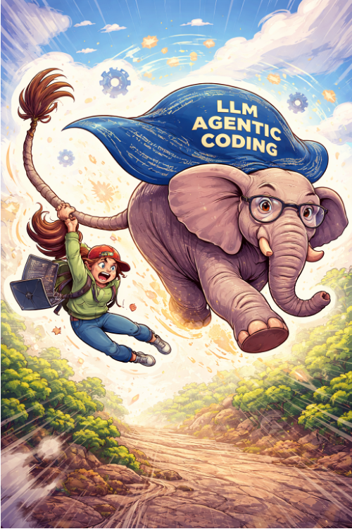
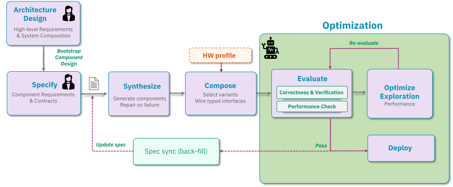
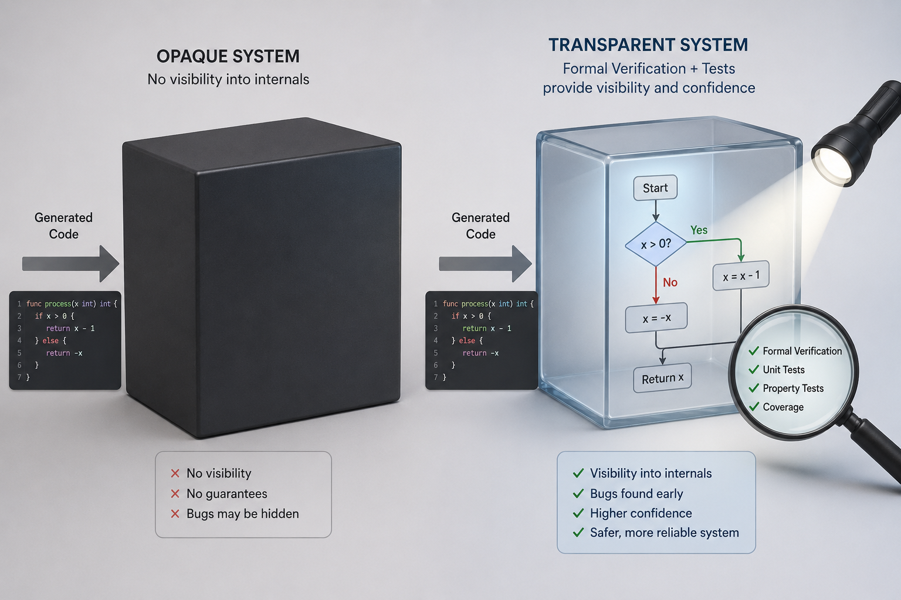
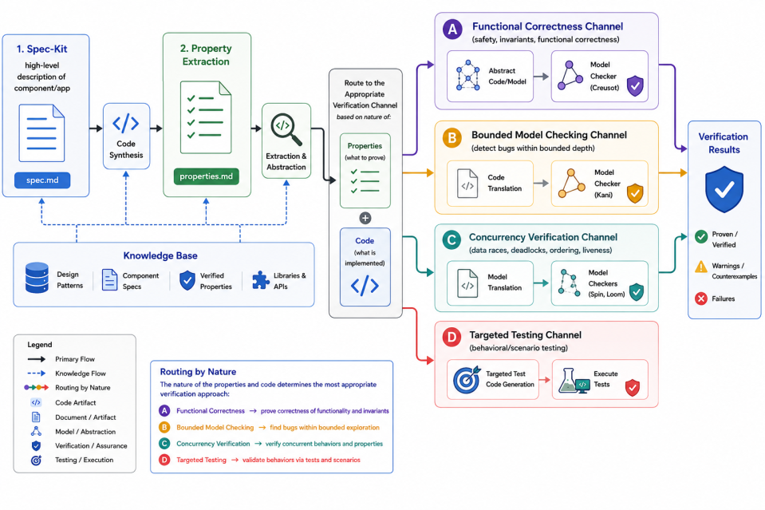
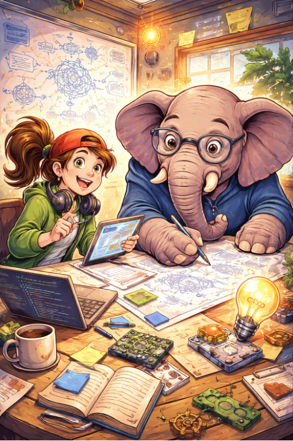

# Holding on to the Wild Elephant

<figure markdown>
  
</figure>

## Introduction

Imagine you are the lead developer on a storage system that has been in production for three years. A bug report arrives: under high concurrency, writes are occasionally silently dropped. You open the codebase — 80,000 lines of Rust, hundreds of components, a dozen contributors. You know this system. You wrote parts of it. But scrolling through the concurrency logic, you feel it: the niggling feeling of not quite trusting your own understanding. Rebuilding the mental model takes days[<a href="#ref-1">1</a>]. The bug, it turns out, was introduced six months ago in a refactor nobody fully remembers designing.

<!-- more -->

This is not a story about bad engineering. It is a story about the fundamental tension in building complex software: code grows faster than understanding. The mental model a developer holds — the living map of how a system works, what invariants must hold, why it was built this way — is the most valuable and most fragile artifact in software development. It erodes constantly: through time, through team turnover, through the reasonable decision to document it later.

For decades the industry's answer was discipline and tooling. Modular design, typed interfaces, code review, unit tests, architecture documents — all attempts to externalize the mental model and keep it legible. They worked, imperfectly. The developer was always the primary agent; understanding and code were produced by the same human mind, and that coupling, however imperfect, kept them tethered.

Then something changed.

LLM-based agentic coding did not just make developers faster. It severed the coupling entirely. For the first time in the history of software, code can exist without anyone having engineered it. The gap between the code and the developer's mental model of it, which used to grow at the pace of a team's capacity to absorb complexity, can now grow arbitrarily wide, arbitrarily fast.

For simple tasks, this is extraordinary. But for systems where correctness is not a matter of degree, the consequences of naive AI use can be severe. A storage system must be correct under every possible interleaving of concurrent operations, every failure mode, every boundary condition — forever. An LLM generating components one at a time, without a theory of the whole system, will produce code that looks right and fails in ways that only surface at 3am under production load. This is not a criticism of the technology. It is a description of what correctness at this level requires: global reasoning that no local generation step can supply.

We discovered this directly in building Certus, our AI-synthesized domain-specific storage system for KV cache and inferencing workloads (see our earlier blog, *Certus: The End of One-Size-Fits-All Storage*[<a href="#ref-2">2</a>]). The agent generated individual components that were locally coherent and passed component-level tests. What the agent could not do was guarantee correct composition, system-level concurrency properties, cross-component consistency or that the invariants we cared about were the invariants being maintained.

The question became: *how do we build a shared understanding between developer and AI that is precise enough to trust what is generated?*

There is a concept in cognitive science called Theory of Mind: the capacity to model another person's beliefs, knowledge, and intentions — what makes high-bandwidth collaboration possible. Without it, even two highly capable people working on the same problem talk past each other, each reasoning from a model the other cannot see.  The same principle applies to human-AI collaboration. When a developer prompts an agent, without a shared representational layer, neither party can verify their understanding aligns. The developer has intent; the agent has capability; but there is no mutual mind connecting them. The result is code that satisfies the literal request while violating the unstated assumptions the developer would have recognized as obvious.

The rest of this post describes the broader issues arising from a lack of mutual mind, and how we overcame them. While Certus is our initial use case, our ambition is a general methodology: using AI to build complex systems with confidence, marrying human understanding with AI's speed.

## What the elephant does when it's out of control

In building Certus, we found that unguided LLM-based synthesis is far from perfect. Without additional control, we repeatedly ran into the following problem areas:

- **Breaking software design principles that aid human understanding and maintenance** - component based design with low coupling and high cohesion are well understood software engineering principles. They are two sides of the same goal: making software easy to change safely. High cohesion means each module is built around a single, well-defined responsibility, so its purpose is easy to understand, test, and reuse, and changes to that responsibility stay contained within it. Low coupling means modules interact through stable, minimal interfaces rather than depending on each other's internals, so a change or failure in one module doesn't cascade through the rest of the system. Together, they minimize the ripple effect of change: a system with both properties can be understood one piece at a time, tested in isolation, modified locally, and evolved incrementally — which is what keeps a codebase maintainable as it grows, rather than becoming more fragile and expensive to touch with every addition. In our experience, Claude does not always adhere to these principles. Making broad changes (a high blast radius) and leaking functions and state outside of well-defined interfaces are often acceptable strategies for Claude: the agent wants to get the job done, with little concern for how.
- **Defying physical hardware limitations** - a particular strength of agentic coding is building extensive correctness and performance regression test functions. These functions are inherently used to drive functional and run-time behavioral characteristics of the system. However, in our experience, the measurements that the agent deems to be correct can be in fact wrong. We know this because the test results reported can simply not be achieved with the underlying hardware. For example, we can take the maximum throughput of a single NVMe SSD with certain parameters (e.g., random read, 128K blocks, PCIe 4.0, max throughput 6 GB/s) and extrapolate what bandwidth is possible from an eight SSD array assuming perfect scaling and sufficient PCIe bandwidth - i.e., 48 GB/s. This is actually a scenario we ran into, where Claude suggested that we have performance of hundreds of GB/s on this hardware. The problem is a combination of hallucination about the correctness of some measurement methodology and the agent "reward hacking" to get a good result as soon as possible.
- **Bias in models** - LLMs are trained on massive amounts of public code and text, which means popular, well-documented patterns are overrepresented relative to niche-but-superior ones. The LLM is statistically more likely to reach for the former — not because it's better for your problem, but because it's more heavily represented in what it learned from. In Certus, we came across this problem with the integration of peer-to-peer (P2P) DMA that moves data directly between SSD and GPU devices, versus bounce-buffer back-to-back DMAs that move data via CPU DRAM. From Claude's perspective, P2P would be the best choice to maximize performance. However, because Claude was not considering the underlying h/w architecture and broader s/w architecture (i.e., the incorporation of a DRAM memory tier and the possibility of pipelining transfers) - it made a bad choice of using P2P. Bounce-buffer is better for the given deployment architecture (plenty of PCIe bandwidth to root complex and the need to promote data into memory tier anyway).  We believe this is likely because GPU Direct (NVIDIA's term for PCIe P2P support) is heavily advertised as a storage system "must have" product capability and sold as a performance differentiator.
- **Overfitting for workload and deployment scenario** - by default, bug fixing and re-factoring are guided by running unit, integration tests and performance tests. In our experience, while this is generally a good approach, changes can be easily over-fitted to the tests. For example, a solution that works successfully for a single-client, single-threaded test is likely not going to be successful for multiple clients since the necessary locking and atomicity is not in place.

## Taming the elephant

Let's now take a look at what measures we took in Certus to address the problem areas discussed - that is, our process to "curb the enthusiasm" of our wild beast!

Each measure below targets one of the problem areas we just described. A component-based architecture — and the design artifacts we derive from it — counters the erosion of sound engineering principles and keeps the system understandable one piece at a time. A hardware knowledge base holds the agent to what the physics of the machine actually permits. Deliberate context and curated knowledge bases pull it away from its statistical defaults toward the design the problem really needs. And formal verification, layered on top of the specifications, guards against correctness that is only skin-deep: code over-fitted to the tests it happened to be handed rather than correct in general. Taken together, these measures are less about constraining the agent than about building the shared, verifiable understanding — the mutual mind — that lets us trust what it produces.

### Apply spec-driven development

The flow starts with defining what the system is supposed to do. We use Spec Kit [^1] to control the workflow for Spec-Driven Development (SDD). The initial specification is given to the system, by a human architect, as a high-level, unstructured natural-language description. We don't sit down for hours on end writing in-depth software requirements; we start with a simple description, and Spec Kit then iteratively clarifies what we have written, filling in the gaps as it interacts with the developer. When the clarification process is complete, Spec Kit generates detailed specifications for user stories, functional requirements, assumptions, research and alternatives, and success criteria. Once all this is in place, Claude generates the tests and synthesizes the code.  

The initial component architecture is designed by the human developer. From the synthesized components a system is composed accordingly. This completes the first phase of creating a functional prototype that can then be refined through interactive optimization. [Figure 1](#fig-ains-flow) shows the overall development flow. Typically, the optimization loop is modifying code rather than specifications, which means that the specifications need to be back-filled from code changes.  Note that after back-filling, the impacted components do not need to be re-synthesized.

<figure markdown id="fig-ains-flow">
  
  <figcaption>Figure 1: AI-Native-Systems Development Flow</figcaption>
</figure>

### Integration with the component architecture

In software engineering, cohesion measures how closely related the internal parts of a single component are to each other, while coupling measures how dependent different components are on one another. Good software design always aims for high cohesion and low coupling.

Certus uses a COM-like component based architecture that allows us to promote good engineering practice (e.g., preventing exposure of state outside of the component interfaces) and also to manage the scope, or "blast radius", of changes being made to the system. Even though many of today's agentic models can support context sizes in the millions of tokens, narrowing the scope of agent interactions also leads to less token burning. Component interfaces and receptacles are syntactic contracts that define how to interact with the component and what dependencies exist. The function definitions of the interface are coupled with natural language properties that shed some light on how the component operates internally and what its semantic behavior is.

The component architecture also allows reasoning and exploration of different potential high-level compositions. For example, an application's composition may vary depending on the availability of hardware (e.g., number of GPUs). Furthermore, the agents building a Certus composition, may want to explore optimizing or replacing/specializing components.

### Maintaining a mental model

As previously discussed, Certus is based on Spec-Driven Development (SDD) that captures system properties, requirements and use-cases in a set of human-readable specifications. Use of SDD goes a long way toward maintaining a mental model — and, crucially, one that the developer and the agent share, rather than a model locked inside a single human head.

Use of a component architecture also helps to maintain a mental model of how the system is constructed at a high-level. In Certus, we use Claude to generate component diagrams (e.g., UML deployment diagrams) from the specifications and the code in order to help gain a deeper understanding of the concrete implementation. Component diagrams are one form of *architectural design artifact* that exist solely to aid human understanding. Other artifacts that we generate from specifications and code include data flow charts, sequence and protocol diagrams, entity relationship diagrams, and performance data reports (e.g., plots of how performance changes in response to changing a specific parameter).

### Extracting hardware behaviors to set boundaries

Recall the second problem area: the agent will confidently report performance numbers that the underlying hardware simply cannot produce. The root cause is that the agent reasons about software in a vacuum. It has a rich model of code and no model at all of the physical machine that code runs on — how fast an SSD actually is, how much bandwidth a PCIe link can carry, how long a DMA transfer really takes. Left to its own devices, it will happily extrapolate a benchmark result to hundreds of gigabytes per second on an array that tops out at tens.

Our answer is to give the agent that missing model, measured rather than imagined. Before any design or optimization agent runs, an *inspection agent* characterizes the target hardware and records what it finds in a knowledge base. It collects the properties that bound real storage performance: NVMe SSD throughput and IOPS at representative block sizes (e.g., 128 KiB random reads - using fio), PCIe link bandwidth (lspci), network bandwidth and latency (`ib_perf`), DRAM bandwidth (Intel mlc), and DMA throughput along the paths that matter — GPU-to-CPU (`gdrcopy_copybw`) and GPU-to-SSD (custom tool). Alternatively to running a microbenchmark, one could envisage scraping the internet for detail specifications - but this is costly from a token perspective and is limited by a lack of understanding of the deployment h/w capabilities.

The measured properties are injected into every design and optimization context as hard boundaries. When an agent proposes an architecture or reports a result, its numbers are checked against the physical ceilings the inspection agent established. The earlier example — Claude claiming hundreds of gigabytes per second from an eight-SSD array — is caught immediately, because the knowledge base records that a single device delivers roughly 6 GB/s and that eight of them, even under perfect scaling and with ample PCIe bandwidth, cannot exceed about 48 GB/s. Just as importantly, the same bounds inform design in the forward direction: knowing the real per-device and per-link limits tells the agent how many SSDs are needed to saturate a network interface, or whether a proposed data path will be starved by the slowest link in the chain. The knowledge base turns the physics of the machine into another part of the shared model, so the agent's enthusiasm is tethered to what the hardware can actually deliver.

### Addressing bias in models

The third problem area is subtler than the first two, because a biased choice looks like a reasoned one. As we saw with the peer-to-peer versus bounce-buffer DMA decision, the agent doesn't pick a heavily-advertised pattern because it has weighed the alternatives and lost; it picks it because that pattern is simply more present in what the model learned from. The bias is statistical, and it is invisible in the output — the code compiles, the rationale reads plausibly, and only a developer who understands the broader architecture would notice that the “obvious” choice is the wrong one.

The key observation is that this bias surfaces only in the absence of overriding context. Given nothing else to go on, the model falls back on its priors; given a strong, specific signal about *this* system and *this* hardware, it will reason from that signal instead. So the fix is not to fight the model's training but to supply the context that outweighs it, through two complementary channels: prompts, for context specific to the task at hand, and knowledge bases, for context that should persist and apply across many agent invocations.

The hardware knowledge base from the previous section is one such source, and the P2P example shows why it matters. In isolation, P2P DMA between SSD and GPU looks strictly superior, and GPU Direct is marketed as an enterprise storage-system “must have.” But once the agent's context includes the facts that Certus incorporates a DRAM memory tier and can pipeline transfers through it, the bounce-buffer path is no longer obviously worse — and the biased default no longer goes unchallenged. Alongside hardware facts, we curate a domain *knowledge base* that captures exactly these kinds of architecture-dependent trade-offs, so that the design agent inherits the reasoning a domain expert would apply rather than the reasoning the corpus happens to favor. 

In Certus, the knowledge base contains four kinds of entries: design patterns curated from existing literature and reference implementations that capture the design space for each KV cache storage concern; component specs that record each module's interfaces, data flows, and invariants; verified properties that the formal verification pipeline ([Section 1](#sec-fv)) has established; and third-party library and API documentation (SPDK, libibverbs, vLLM) needed for integration code. Entries are authored by the developer or drafted by a knowledge-curator agent and reviewed before use, kept current as the architecture evolves, and selected into a working agent's context by task scope. That focused, system-specific evidence gives the model a concrete alternative to its learned default.

### Assuring behavior through formal verification

Formal verification is able to test properties based on some mathematical model of the system. Historically, it has been reserved for mission-critical systems where failure could lead to catastrophe such as loss of life.  However, for LLM-based agentic coding, formal verification has another role ([Figure 2](#fig-fv_trans)) – ensuring that the specification is aligned with the synthesized code and also, by abstraction of different properties into comprehendible models, helping the human build her own mental model of the system.

<figure markdown id="fig-fv_trans">
  
  <figcaption>Figure 2: Applying formal verification is key to providing transparency of code and assurance of what is implemented</figcaption>
</figure>

Historically, the burden of writing verifiable models and ensuring that they are aligned with the code is significant and only possible with expert knowledge. LLM coding agents change this equation – translation is one of their key strengths. In the context of Certus, and its use of spec-driven development, the code synthesis takes the detailed specifications and generates Rust code. After this, the specifications and code are used in the following four verification pipelines (see [Figure 3](#fig-formal)): 

1. Generate *abstract code* that can be model checked for functional and logic correctness (e.g., Creusot [<a href="#ref-3">3</a>] - deductive prover via SMT).  The abstract code uses the same programming language as the concrete code.
2. Instrument the concrete code with *function wrappers* and *test harnesses* that check for low-level issues such as out-of-bounds accesses or integer overflow (e.g., Kani [<a href="#ref-4">4</a>], Loom [<a href="#ref-5">5</a>]).
3. Generate an *abstract model* that represents the checkable properties (e.g. Promela [<a href="#ref-6">6</a>] for Spin [<a href="#ref-7">7</a>]). Abstract models are not written in program code.
4. Convert remaining properties to run-time tests that are specifically focused on testing the properties in question.

So how do these translations operate? The details are technical, but the shape is the same in each case: read the code, distill the properties that actually matter, and re-express them in a form a checker can reason about. For abstract code, such as is necessary for the Creusot checker, the coding agent first reads the implementation to understand its logic and extracts the key correctness properties rather than transliterating the code. Next, everything that can't be reasoned about is stripped out (e.g., HashMap, Arc can't be handled). Everything is reduced to pure functions (i.e., a function whose output depends only on its input, and which has no observable side-effects). From here, the agent converts the stripped and simplified code to specifications in Creusot's dialect that can be readily model checked.

For Kani and Loom, the specs and code are used to create test harnesses and to extract functions into those harnesses. This process begins by again first reading the source to understand the logic. The first step is to replace unsafe/FFI with safe stubs (e.g., replacing a pointer-based array to a Vec<u8>, Drop becomes no-op) and looking for code that are likely "hot-spots" of checkable properties (e.g., list manipulation). Next, the agent writes the test harnesses replacing parameter assignments with the `kani::any()` and inserting `kani::assume()` for pre- and post-conditions. Finally, the test harnesses can be run to audit the checkable properties.

<figure markdown id="fig-formal">
  
  <figcaption>Figure 3: Formal verification flow</figcaption>
</figure>

#### The formal verification gotcha!
The soundness of formal verification is dependent on the ability to *correctly* transform specifications and code to checkable models and tests. What happens if the agent adds code that is not required or is even dangerous from a security or stability perspective? What happens if the algorithm is mis-translated? What happens if a critical operation is removed through abstraction? Without assurance of translation, the model checkers are verifying code that does not exist! Worse still, we can't ask an agent to check itself and expect it to have newly found levels of oversight or correctness (well, we can, but only so far).

To address this problem, Certus employs different coding agents (e.g., Codex) to independently cross-check the translation source and target forms. To validate this approach we created a systematic method of "poisoning" code and specifications that create mismatches between source and target. We then perform the cross-checking and ensure that all of the poison items have been correctly identified.

## Summary

We began with a familiar scene: a developer, three years into a production system, no longer quite trusting their own understanding of it. That erosion of the mental model — the living map of how a system works and why — is an age-old problem in software engineering. What is new is that LLM-based agentic coding has severed the coupling between code and understanding. Code can now be produced faster than any human, or team of humans, can absorb it. For simple tasks this is liberating. For systems where correctness is not negotiable — storage, kernels, compilers — it is a liability, because a wild agent will happily generate code that looks right, passes its own tests, and fails silently at 3am under a concurrency interleaving no one reasoned about.

Certus is our attempt to hold on to the elephant without breaking its stride. Rather than choosing between the speed of the agent and the confidence of the human, we built a *mutual mind*: a shared, precise, continuously verifiable representation that both developer and AI reason from. That mutual mind is not a single artifact but a discipline woven through the whole process. Spec-driven development makes intent explicit and keeps the developer's understanding durable as the code grows. A COM-like component architecture enforces high cohesion and low coupling, bounding the blast radius of change and keeping the system understandable one piece at a time. A hardware knowledge base grounds the agent in physical reality, so it can no longer promise hundreds of gigabytes per second from an array that can deliver tens. Explicit context and knowledge bases pull the agent away from its statistical defaults toward the design that actually fits the problem. And formal verification — with independent agents cross-checking every translation from code to checkable model — turns the specification into a source of proof, not just a source of code, with targeted runtime tests filling the gaps where proof is out of reach.

The result is a development process in which neither party is flying blind. The agent supplies speed and breadth; the developer supplies intent and judgment; and the shared, verifiable model between them ensures that what gets built is what was meant — and that the invariants we care about are the invariants being maintained. The elephant is still powerful, still fast. It is simply no longer out of control.

Certus is our first use case, and much of what we describe here is still evolving. But our ambition is broader than a single storage system: a general methodology for using AI to build complex, correctness-critical software with confidence — marrying human understanding with the AI's speed, so that the mental model, that most valuable and most fragile artifact, is no longer the thing we lose.

Certus is an open-source project which can be found at:

<https://github.com/AI-native-Systems-Research/ai-native-storage-certus>

*Feedback and collaboration are welcome.*

Please contact us at <ai-native-storage@ibm.com>

<figure markdown>
  
</figure>

[^1]: https://github.com/github/spec-kit

---

## References

[1] Osborn, J.
 AI didn't make programming easier. It just made it differently difficult.
 *Communications of the ACM*, 2026.
 <https://doi.org/10.1145/3795534>

[2] Waddington, D., Factor, M., Batsoyol, N.
 Certus: The End of One-Size-Fits-All Storage.
 <https://ai-native-systems-research.github.io/ai-native-systems-research/blog/2026/06/17/certus-the-end-of-one-size-fits-all-storage/>

[3] Denis, X., Jourdan, J.-H., and Marché, C.
 Creusot: A Foundry for the Deductive Verification of Rust Programs.
 In *Formal Methods and Software Engineering (ICFEM 2022)*, LNCS 13478, Springer, 2022, pp. 90–105.
 <https://doi.org/10.1007/978-3-031-17244-1_6>

[4] Delmas, R., Hassan, Z., Hu, Q., Kumar, R., Monteiro, F. R., Nguyen, T., Palacios, A., Val, C., Tautschnig, M., Adam, J., Schwartz-Narbonne, D., and Zech, C.
 Kani: A Model Checker for Rust.
 In *39th IEEE/ACM International Conference on Automated Software Engineering (ASE 2026), Industry Showcase Track*, 2026.
 <https://arxiv.org/abs/2607.01504>

[5] Tokio.
 Loom: Concurrency permutation testing tool for Rust.
 <https://docs.rs/loom/latest/loom/>

[6] Holzmann, G. J.
 *The SPIN Model Checker: Primer and Reference Manual*.
 Addison-Wesley, 2004.

[7] Holzmann, G. J.
 The Model Checker SPIN.
 *IEEE Transactions on Software Engineering*, 23(5):279–295, 1997.
 <https://doi.org/10.1109/32.588521>
