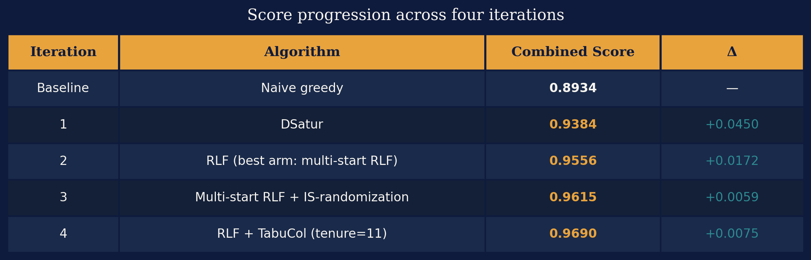

# The Scientific Method on Code: How a Hypothesis-Driven AI Learned What Evolution Couldn't

*Part 2 of a series on AI-driven algorithm discovery. [Part 1 is here.](https://medium.com/@tamareilam/can-ai-reinvent-algorithms-i-spent-my-api-budget-finding-out-403fbae2850a)*

The first post ended on a cliffhanger.

I had spent weeks running an evolutionary AI framework — OpenEvolve — against a classic graph theory problem, watching it rediscover a 1979 algorithm called DSatur and then spin its wheels. It kept proposing variations on the same idea. It couldn't reason about why things worked or didn't. When I explicitly asked it to implement Kempe chains — an elegant post-processing technique — it produced buggy code that never ran a single useful operation.

The root cause, I argued, was structural: mutation-based evolution finds better code without understanding it. There's no mechanism to ask *why* something works, no way to rule out dead ends, no compounding of knowledge across iterations. The AI was playing a slot machine, not doing science.

So I decided to try the other philosophy. Instead of evolution, I used a framework built around the scientific method: the [Nous open-source project](https://github.com/AI-native-Systems-Research/agentic-strategy-evolution). Same benchmark. Same problem. Same starting algorithm. Completely different approach.

What followed was one of the more instructive experiments I've run — not because the AI succeeded spectacularly, but because of what the structure of failure and success revealed about where this technology actually is.

<!-- more -->

---

## A Quick Recap: Graph Coloring and Why It's Hard

Graph coloring is deceptively simple to state: given a graph — a set of nodes connected by edges — assign a color to each node so that no two connected nodes share a color. Use as few colors as possible. The minimum number of colors required is called the **chromatic number**, written χ (chi).

The problem is everywhere in disguise. Scheduling exams so no student has two at the same time? Graph coloring. Assigning radio frequencies so nearby towers don't interfere? Graph coloring. Allocating CPU registers in a compiler? Also graph coloring.

The catch: finding the exact minimum is NP-hard. So in practice, we use heuristics — fast algorithms that find good-enough solutions without guaranteeing optimality. The benchmark I used in both experiments is a suite of 22 graphs in the standardized DIMACS format, each with a known chromatic number. A mix of classes chosen because they're *hard to color*: seven queen graphs, four Mycielski graphs, four "book" graphs built from character co-occurrence in novels, two distance graphs between US cities, a college-football schedule graph, three register-allocation graphs from real compilers, and one large Leighton scheduling graph. The score for each graph is a weighted combination of coloring quality (how close to χ) and speed.

In Part 1, OpenEvolve rediscovered **DSatur** (Brélaz, 1979): instead of coloring vertices in arbitrary order, prioritize the vertex with the most differently-colored neighbors already assigned. OpenEvolve found it by iteration 2 and never moved past it. Combined score: 0.9384, up from the greedy baseline of 0.8934. Not bad. But stuck.

The question I wanted to answer with Nous: *can a framework that forces explicit causal reasoning do better?*

---

## A Different Philosophy: The Scientific Method on Code

The difference between OpenEvolve and Nous is not primarily technical. It's philosophical.

OpenEvolve treats the LLM as a **mutation operator**. Give it the current best program. Ask it to make a change. Score the result. Keep the winners. Repeat. No hypothesis required. No explanation needed. Just fitness and selection.

Nous treats the LLM as a **scientist**. Before running any experiment, the AI must commit to a falsifiable claim: *I predict this mechanism will produce this measurable effect, because of this causal explanation.* Then it runs the experiment. Then it extracts structured lessons — whether the hypothesis was confirmed or refuted. Those lessons constrain the next iteration. The system gets smarter over time, and crucially, it can't un-learn what it's already ruled out.

Here's how a Nous campaign works in practice. Each iteration has two AI working phases — **Design** and **Execute-and-Analyze** — separated by two human approval gates, and it closes by committing what it learned to a persistent principles store:

```
DESIGN (Claude Opus)
  → Human Design Gate
    → EXECUTE & ANALYZE (Claude Sonnet)
      → Human Findings Gate
        → EXTRACT PRINCIPLES → persistent store
          → next iteration
```

The central object is the **hypothesis bundle**. Rather than testing one idea, each iteration tests a *family* of related questions simultaneously, across five arms:

- **h-main** — *Does this mechanism work, and why?* The primary hypothesis, stated with a causal explanation.
- **h-ablation** — *Which component is load-bearing?* Remove one piece and show what's essential.
- **h-super-additivity** — *Do the pieces compound?* Test whether the whole exceeds the sum of its parts.
- **h-control-negative** — *Where should it not work?* A negative control that confirms causality rather than coincidence.
- **h-robustness** — *Does it generalize?* Vary a parameter and test sensitivity.

This structure transforms the question from *"did the score go up?"* to *"do we understand why the score went up?"* — and crucially, *"what exactly can we rule out?"*

Two AI agents do the work. The **Planner** (Opus) explores the codebase, reads the accumulated principles from prior iterations, and produces the hypothesis bundle. The **Executor** (Sonnet) implements all arms, runs experiments in an isolated git worktree, compares observed metrics against predictions, and proposes new principles. The human gates are hard stops. Once the findings gate is approved, the iteration's principles are committed to the store.

Knowledge accumulates in that living principles store. Each confirmed mechanism becomes a constraint on the next design. The Planner cannot propose a bundle that contradicts an established principle without explicit justification. By Iteration 4, the system had 17 active principles — a growing map of what works, what doesn't, and why.

The campaign ran for four iterations in May 2026, using Claude Opus 4.5 for design and Claude Sonnet for execution. Total spend: $17.21 across ten model calls — $11.85 on the six Opus design calls, $5.37 on the four Sonnet execute-and-analyze calls.

---

## The Campaign: Four Iterations of Structured Discovery

### Iteration 1: Does Vertex Ordering Matter?

**Starting score: 0.8934 → Ending score: 0.9384 (+0.0450)**

The greedy baseline processes vertices in their original order and assigns the smallest available color to each. It's fast and simple and, as the campaign would confirm, actively harmful on some graphs. The DIMACS natural vertex ordering turns out to be mildly adversarial.

The first research question: *does the order in which we color vertices matter, and if so, what makes an ordering good?*

The answer was unambiguous. DSatur — discovered independently here, as in the OpenEvolve experiment — improved the combined score by +0.0450. But what made this iteration genuinely informative wasn't the score. It was the causal dissection the arms provided.

The **h-ablation** arm tested Largest-First ordering: sort vertices by degree before starting, then proceed greedily. It improved over baseline (+0.0171) but fell well short of DSatur (+0.0450). This isolated a specific mechanism: it's not that *any* informed ordering helps — it's that *dynamic* constraint tracking during coloring is what matters. Knowing a vertex has many neighbors (degree) is useful. Knowing how many *different colors* its neighbors already have (saturation) is more useful, because that's a direct measure of how constrained your choices will be.

The **h-control-negative** arm tested random ordering. This produced a surprising finding: random ordering also improved over baseline (+0.0166), nearly matching the Largest-First improvement. The DIMACS files' natural vertex ordering is so adversarial that even shuffling randomly helps. This fact — that roughly 37% of DSatur's total gain comes simply from *not* using the original order, with 63% attributable to the saturation signal itself — became a precise, quantified principle.

One anomaly worth noting: DSatur actually *regressed* on queen7_7, using 11 colors instead of the baseline's 10. On this particular 7×7 chessboard graph, all vertices have nearly equal saturation degree and overall degree, so DSatur's tiebreaking degenerates to vertex index — restoring an adversarial order. The framework flagged this as a principle: vertex-transitive graphs are specifically resistant to saturation-based heuristics.

**Key principles extracted:** Vertex ordering is load-bearing. Dynamic saturation tracking is the mechanism, not just degree. The DIMACS natural order is mildly adversarial. le450_15c — the hardest graph in the suite — improved from 30 to 23 colors but remains far from χ=15: it requires something fundamentally different.

!!! note "A word on le450_15c, the campaign's stubborn case"
    This is a Leighton graph: 450 vertices, ~16,680 edges, average degree ~74. Leighton graphs have a useful property — the chromatic number is known by construction. The generator plants a clique of size k, so χ is guaranteed to be exactly k — here, 15. The naming encodes this: le450_15c is a 450-vertex graph with χ=15.

    The honest part: le450_15c isn't actually unbeatable — specialized graph-coloring solvers reach 15 or 16 on it without enormous effort. Our RLF-based pipeline, by contrast, plateaued at 23 for three iterations and only reached 22 once TabuCol arrived. That persistent 7-color gap is the clearest single illustration of the difference between a general construction-and-tuning approach and a solver specialized for this problem.

---

### Iteration 2: Build Color Classes, Not Just Pick Vertices

**Starting score: 0.9556 (multi-start RLF discovered as best arm) → h-main: 0.9540 (+0.0156 over DSatur)**

!!! info "A note on baselines"
    Throughout this campaign, the h-main result sets the official score for each iteration. But sometimes an arm discovers something better. In Iteration 2, the robustness arm found multi-start RLF at 0.9556, which became the baseline for Iteration 3. This is the hypothesis bundle working as intended: structured exploration surfacing unexpected wins.

DSatur works at the level of individual vertices — it always asks "which single vertex should I color next?" Iteration 2's research question was more ambitious: *what if instead of picking vertices one at a time, we build entire groups of non-conflicting vertices at once?*

It's worth being clear about where that question came from: **the AI proposed it, not me.** I never suggested RLF, or independent sets, or any specific algorithm. The Planner explored the codebase, read its own Iteration 1 principles, and decided on its own that the next thing worth testing was a shift from vertex-level to color-class-level construction. My only role at the design gate was to approve or reject — and I approved.

This is the idea behind **Recursive Largest First (RLF)**, an algorithm from Frank Leighton in 1979.

#### Understanding Independent Sets

An independent set is a group of vertices in a graph that have no edges between them. If you can find an independent set, you can color all its members with the same color: no two of them are adjacent, so there's no conflict.

Graph coloring is, at its core, a problem of partitioning vertices into independent sets. Each color class *is* an independent set. The fewer independent sets you need to cover all vertices, the fewer colors you use.

#### How RLF Builds a Color Class

RLF builds one color class at a time. It starts the class with a seed vertex (the highest-degree uncolored vertex), and immediately marks all the seed's neighbors as **blocked** — they can't join this class. Then it grows the class using the **block-counting rule**:

> Among all the vertices still eligible to join the current class, choose the one with the **most neighbors already in the blocked set**.

The intuition: when you pick a vertex whose neighbors are mostly *already* blocked, adding it to the class costs very little — most of the vertices it would have excluded were excluded anyway. You're picking the vertex whose "damage" is already sunk. Greedily preferring these vertices packs each color class as densely as possible, which means fewer classes — fewer colors — overall.

---

🎨 **[Watch the RLF animation: building color classes step by step →](https://eilamt.github.io/graph-coloring/rlf_animation.html)**

*(Step through it with Next, or hit Auto. Watch the blocked set grow in red as each vertex joins the current class, and watch the block counts — neighbors already blocked — drive each choice.)*

---

The ablation arm tested RLF *without* block-counting — replacing it with a simple degree heuristic. The result was striking: not only did it fail to match RLF, it actually scored *below* DSatur (0.9249 vs 0.9384). Building independent sets is only better than DSatur when you're building them *correctly*. The block-counting rule isn't an optimization — it's the entire mechanism.

The super-additivity arm tested a DSatur+RLF ensemble: run both and keep whichever uses fewer colors. Result: identical to RLF alone on all 22 graphs. RLF uniformly dominated DSatur — not on most graphs, on *every single one*. DSatur was retired.

**Key principles extracted:** Block-counting is the load-bearing mechanism of RLF, not the independent-set framing itself. RLF uniformly dominates DSatur. le450_15c remains at 23 — resistant to everything.

---

### Iteration 3: What If Randomness Is the Key?

**Starting score: 0.9556 → Ending score: 0.9615 (+0.0059)**

RLF is deterministic. Given the same graph, it always produces the same coloring. The research question: *what if we run RLF multiple times with different starting conditions and keep the best result?*

The mechanism is called **multi-start RLF with IS-randomization**. Two sources of randomness are introduced:

1. **Seed diversity**: each run starts from a different first vertex when building the first independent set
2. **IS-randomization**: within each run, when two vertices are tied for the block-count criterion, choose randomly rather than by index

The ablation arm isolated the two mechanisms cleanly. Seed diversity alone improved queen11_11 from 14 to 13 colors but couldn't improve queen6_6. The full combination found queen6_6=7 (its chromatic number) while the seed-only ablation could not, so the difference is attributable to IS-randomization. The two mechanisms attack *different* graphs — seed diversity helps larger structured queens, IS-randomization helps smaller symmetric ones. Both are needed.

The robustness arm produced the most instructive result: a refutation. The hypothesis predicted that uniform K=4 across all graphs would capture most of the gain. It captured *none*. The combined score was 0.9556 — identical to the Iteration 2 baseline. The gain from multi-start RLF isn't gradual. It's discontinuous: you need at least K=6 for small graphs (n≤130), and anything less is equivalent to K=3 deterministic. This kind of sharp threshold would be invisible to a mutation-based approach.

And then the Kempe chains question, carried over from Part 1. The Executor implemented a Kempe-chain elimination pass on top of multi-start RLF, and this time the implementation was *correct*: the component search walks the two-color subgraph properly and the swaps preserve a valid coloring.

The result: **zero reductions on all 22 graphs.** But I want to be careful about what that does and doesn't establish. The variant that ran was a *restricted* form — it only ever tried to eliminate the single *smallest* color class; it skipped the attempt if that class held more than n/4 of the vertices; it required a *single* alternative color to absorb the entire class in one sweep; and it stopped at the first pass that failed.

So the honest conclusion is narrower than "Kempe chains never help." It's: *this restricted Kempe variant finds no improvement on multi-start RLF colorings across this benchmark.* The principle the system recorded (RP-13) is a good illustration of why the `applicability-bounds` field in principles.json matters:

> **RP-13** *(domain principle, confidence: high)*
>
> **Statement:** "Kempe-chain post-processing on multi-start RLF (adaptive K=6/4/3) yields zero improvement on all 22 DIMACS benchmarks. Multi-start RLF color classes are already Kempe-stable: no Kempe-chain swap can eliminate any color class from the resulting coloring."
>
> **Regime:** "22 DIMACS benchmark graphs, adaptive K multi-start RLF as initial coloring"
>
> **Applicability bounds:** explicitly does *not* rule out (a) Kempe on DSatur output, (b) Kempe in a more complex local search — "iterated Kempe chains targeting pairs of classes, not just the smallest" — or (c) TabuCol / simulated annealing.

**Key principles extracted:** IS-randomization and seed diversity are complementary mechanisms targeting different graph structures *in this suite*. The K-schedule gain is discontinuous — K=6 is a threshold for these graph sizes and this budget. The restricted Kempe variant yields no improvement after multi-start RLF. le450_15c confirmed resistant to all greedy and multi-start methods across three iterations.

---

### Iteration 4: Stop Building — Start Repairing

**Starting score: 0.9615 → Ending score: 0.9690 (+0.0075)**

The first three iterations all worked the same way: find a better algorithm for building a valid coloring from scratch. All of these are **construction heuristics**.

The principles accumulated over three iterations pointed at a ceiling. The fourth research question made a conceptual jump: *what if we stop building and start repairing?*

This pivot is the single most interesting decision in the campaign, and again, **the AI made it — not me.** Reading its own accumulated principles, the Planner concluded that construction heuristics had been exhausted and that the next move had to be a different *class* of algorithm entirely. It proposed switching from building colorings to repairing them. No human suggested local search; the framework reasoned its way there from what it had ruled out.

The algorithm is **TabuCol** (Hertz & de Werra, 1987). The idea is different in kind from anything tried before:

1. Start with a valid k-coloring from multi-start RLF
2. Forcibly try to squeeze it into k−1 colors: remap some vertices to a reduced color palette, deliberately introducing conflicts
3. Iteratively repair: at each step, find the move — vertex v to color c — that most reduces the total conflict count
4. Keep a **tabu list**: recently moved vertices are temporarily forbidden from moving back to their old color, preventing the search from cycling
5. If conflicts reach zero, you have a valid (k−1)-coloring. Try k−2. Repeat until time runs out.

TabuCol doesn't require a move to be beneficial. It will *increase* conflicts if that's the best available option. This is what allows it to escape local minima — temporarily making things worse to reach a region of the search space that opens up further improvement.

The main hypothesis was confirmed: combined score 0.9659, with le450_15c finally cracking from 23 to 22 colors. After three iterations of stubborn resistance, the first crack in le450_15c's armor — and it required a completely different mechanism class to produce it.

But the most interesting result came from the robustness arm. The classical recommendation for TabuCol's tabu tenure parameter is 7–15 (Hertz & de Werra's own suggestion). The h-main arm used tenure=7; the robustness arm varied it to tenure=11. Result: **0.9690**, the best score across any arm in any iteration. queen7_7 dropped from 9 to 8 colors — an improvement the main arm couldn't achieve. Tenure=11 became the campaign's best result.

**Key principles extracted:** TabuCol operates in conflict-repair space, sidestepping the construction ceiling. The tabu memory mechanism is load-bearing — random walk without tabu is no better than baseline. Tenure=11 is strictly better than tenure=7 for symmetric queen graphs. le450_15c cracks to 22 — reachable via local search, still far from χ=15.

---

## What the Framework Actually Learned

The principles accumulated across four iterations form a causal chain, not just a list of facts:

- **RP-1/2 (Iter-1):** Vertex ordering matters. Dynamic saturation tracking is the mechanism. → This tells us *what signal to track*.
- **RP-4 (Iter-1, confirmed across Iter-2 and 3):** le450_15c is resistant to all ordering-based methods. → This rules out an entire approach family before it's tried.
- **RP-8 (Iter-2):** Block-counting is the load-bearing component of RLF. → This tells us *why* RLF works, not just *that* it works.
- **RP-13 (Iter-3):** A restricted Kempe-chain post-processing variant finds no improvement on RLF colorings across this benchmark. → This closes a direction of inquiry *for this benchmark and this variant*, with applicability bounds recorded.
- **RP-16/17 (Iter-4):** TabuCol's tabu memory is load-bearing. Tenure=11 outperforms the classical tenure=7 on symmetric graphs. → These constrain the next investigation's starting point.

Each principle is a constraint on the next design. The system gets narrower search space and sharper hypotheses with each iteration. The overall score progression:

| Iteration | Algorithm | Combined Score | Δ |
|---|---|---|---|
| Baseline | Naive greedy | **0.8934** | — |
| 1 | DSatur | **0.9384** | +0.0450 |
| 2 | RLF (best arm: multi-start RLF) | **0.9556** | +0.0172 |
| 3 | Multi-start RLF + IS-randomization | **0.9615** | +0.0059 |
| 4 | RLF + TabuCol (tenure=11) | **0.9690** | +0.0075 |



The gains are diminishing — which is expected. The easy improvements come first. But crucially, each iteration represents a genuine change in the *kind* of algorithm being used, not just parameter tuning. DSatur → RLF is a shift in granularity (vertices → color classes). RLF → TabuCol is a shift in approach (construction → repair). These are paradigm changes, not refinements.

---

## The Honest Comparison: Nous vs. OpenEvolve

**Nous clearly produced better results.** OpenEvolve stagnated at 0.9384 (DSatur). Nous reached 0.9690 — a gap of more than 0.03 combined score. Nous made three genuine paradigm shifts across four iterations. OpenEvolve made only one.

**But the comparison has a confound, and it's a big one.** The Nous campaign ran on Claude Opus 4.5 for design and Claude Sonnet for execution. The OpenEvolve experiments ran on a different, generally weaker backend: Gemini 2.0 Flash (free tier), with Claude Sonnet 4.5 as the optional alternative for some runs. No Opus model drove OpenEvolve at all. I can't cleanly separate the framework effect from the model effect.

That said, the backend gap doesn't explain the *kind* of difference we saw. A stronger model produces better individual proposals, but it doesn't, on its own, create a mechanism for ruling out dead ends or for pivoting from construction to repair after three iterations of accumulated principles. Those came from the structure, not the model.

**What the framework difference explains, regardless of model:** OpenEvolve had no mechanism to rule out dead ends. It kept proposing post-optimization recoloring passes that achieved zero recolorings — in experiment after experiment. Nous ruled out its Kempe variant in a single arm (RP-13) and carried that principle into every subsequent iteration. No equivalent of RP-13 is possible in a mutation-based system, because there's nowhere to store "we checked this; it doesn't help here."

OpenEvolve also couldn't make the construction-to-repair conceptual jump. Every proposal was a variation on the greedy construction paradigm. Nous's fourth iteration crossed that boundary not because a mutation happened to produce TabuCol, but because the principle accumulation had explicitly eliminated the construction approach as a path to further improvement, forcing the designer to consider a different mechanism class entirely.

The deepest difference: **OpenEvolve blindly finds better scores. Nous builds a model of the problem.**

One more thing the logs make clear. The references in this post — Brélaz 1979, Leighton 1979, Hertz & de Werra 1987 — didn't come from me. I never mentioned an algorithm by name. The Planner brought them itself: with web access enabled, it did its own literature search, named the canonical algorithms in its design documents, and decided which to try. So the human contribution here was almost nothing on the "what to try" axis. What the campaign genuinely *produced* wasn't the algorithms — those were known — it was the experimental determination of *which mechanisms actually matter on this workload and how to tune them*: block-counting is load-bearing, IS-randomization and seed diversity are complementary, tenure=11 beats the textbook default here.

---

## Conclusions: What This Tells Us — and What It Doesn't

### What worked

The hypothesis bundle structure genuinely changed the quality of knowledge produced. Having five arms per iteration meant each iteration answered not just "did it improve?" but "which component caused the improvement?", "what does this compare against?", and "where does it break down?" The robustness arm in particular was productive beyond its primary purpose — it surfaced the tenure=11 finding that became the campaign's best result.

The principle accumulation worked as designed. By Iteration 4, the Planner had a 17-principle map of the problem that ruled out entire families of approaches and focused the search on what remained genuinely open. This is the structural difference from mutation-based evolution: the system's search space *narrowed* with each iteration, rather than remaining the same size throughout.

### The two big limitations — and why they might be features

**Limitation 1: It overfit to 22 graphs.** The principles got more benchmark-specific with each iteration. "IS-randomization helps small symmetric queens," "tenure=11 beats tenure=7 on the queen family," "K=6 is the threshold for n≤130" — these are precise statements about *these* 22 graphs, not about graph coloring in general. We have no evidence they transfer to random geometric graphs, register-allocation graphs from a compiler we didn't test, or anything outside the suite.

**Limitation 2: It didn't discover anything new.** Every algorithm it found — DSatur (1979), RLF (1979), TabuCol (1987) — is in the textbooks. The system independently rediscovered four decades of graph coloring research, which is genuinely impressive, but it raises a pointed question: is the model *reasoning*, or *pattern-matching* to algorithms it saw in training? The honest answer is we don't know. (Ironically, the OpenEvolve experiments in Part 1 got *closer* to novelty in one case — the impractical clique-based tie-breaking — precisely because blind mutation doesn't pattern-match to known algorithms.)

Now the complication. **For the field I actually care about — applied algorithms for computer systems — both of these "limitations" describe exactly what we want.**

In systems research, we very rarely invent a new algorithm. What we do, almost all the time, is take known mechanisms — scheduling disciplines, cache-eviction policies, load-balancing strategies — and *select, combine, and tune* them for the specific characteristics of a particular environment and workload. The win comes from fitting the mechanism to the deployment, not from inventing a mechanism nobody has seen. And "fitting to the deployment" is *precisely* overfitting.

Read through that lens, the two limitations invert:

- Overfitting to 22 graphs isn't a failure of generalization — it's the system doing exactly what an AI-Native System should do when handed a specific environment: discover and tune the mechanisms that work best *for that environment*.
- Not inventing a new algorithm isn't a poverty of imagination — it's good engineering judgment. Reaching for DSatur, then RLF, then TabuCol, and combining RLF→TabuCol with a tuned tenure, is what an expert would do: stand on the literature, compose known parts, and fine-tune.

So whether these are bugs or features depends entirely on what you're asking the AI to do. If the goal is *algorithmic discovery* — extend human knowledge, find something genuinely new — they're real limitations. If the goal is *AI-Native Systems research* — autonomously find and tune the mechanisms that work best in a specific deployment — this is not a bug. It's the entire point.

### What's next

Two directions I want to pursue. The first is a proper head-to-head against **Glia**, the MIT framework for AI-driven systems design (later renamed Engram; paper at [arxiv.org/abs/2510.27176](https://arxiv.org/abs/2510.27176)). Running both against the same systems problem, with the same backend model, would actually isolate what the hypothesis-bundle structure buys you.

The second is the harder and more important one: can a hypothesis-driven approach produce a genuine *breakthrough* — a mechanism that isn't already in the literature — rather than expert-level rediscovery and tuning? Graph coloring was the wrong problem to answer that with, precisely because 40 years of excellent algorithms are sitting in the training data. The right test is a problem where the good answer *isn't* known, where pattern-matching has nothing to match. That's the experiment I want to run next.

That's the question worth chasing. The framework knows how to rule things out, tune to an environment, and explain itself along the way. Whether it can invent — that we don't yet know.

---

## Try It Yourself

The complete Nous campaign — all four iterations, all hypothesis bundles, all findings, all accumulated principles — is preserved at:

🔗 [github.com/eilamt/graph-coloring](https://github.com/eilamt/graph-coloring/tree/main/.nous/graph-coloring-v1)

The Nous framework itself is open-source:

🔗 [github.com/AI-native-Systems-Research/agentic-strategy-evolution](https://github.com/AI-native-Systems-Research/agentic-strategy-evolution)

The OpenEvolve graph coloring example from Part 1 — evaluator, the 22 DIMACS benchmarks, and the archived evolution runs — lives in an open pull request:

🔗 [github.com/algorithmicsuperintelligence/openevolve/pull/396](https://github.com/algorithmicsuperintelligence/openevolve/pull/396)

---

*The interactive RLF animation referenced in Iteration 2 is at [eilamt.github.io/graph-coloring/rlf_animation.html](https://eilamt.github.io/graph-coloring/rlf_animation.html). All benchmark data uses the standard DIMACS graph coloring instances.*
