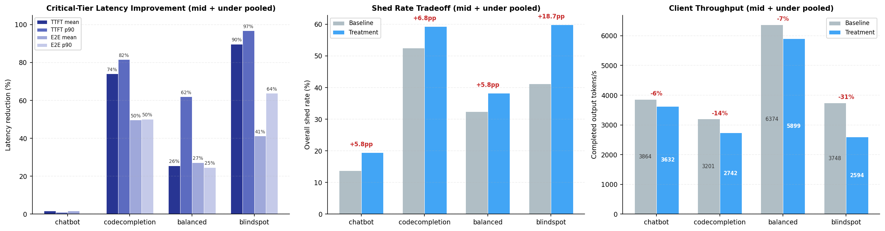

# From Simulation to Production: How an AI-Native Pipeline Discovered a Better Admission Controller for llm-d

*A case study in closing the AI-native loop: observe, reason, change, validate, deploy.*

## Introduction

An [AI-native system](ai-native-systems-autonomous-evolution.md) is one that continuously and autonomously closes the loop from observation to action to deployment, with AI as the primary agent driving this process. Rather than humans manually directing each improvement, humans establish objectives and boundaries while the system autonomously executes the cycle, at machine speed.

<!-- more -->

This post tells the story of the first end-to-end traversal of that loop for the system under control: [llm-d](https://github.com/llm-d/llm-d), an open-source distributed LLM inference platform. The concrete outcome is the **probabilistic admitter**, an AI-native-evolved admission control plugin that cuts tail latency by up to 97% on overloaded workloads. It is now merged into [llm-d-router](https://github.com/llm-d/llm-d-router), and users can enable it today following the instructions [here](https://github.com/llm-d/llm-d-router/blob/main/docs/plugins/probabilistic-admitter.md).

The story follows this loop through each phase. It began with our AI-native discovery and reasoning framework ([Nous](https://github.com/AI-native-Systems-Research/agentic-strategy-evolution)) giving the insight that there is an opportunity for performance improvement in llm-d's admission control behavior. By pairing Nous with a high-fidelity llm-d simulator ([BLIS](https://inference-sim.github.io/inference-sim/latest/)), Nous iteratively proposed and evaluated new algorithms that yield strongest latency reduction in simulation. We then translated the most promising algorithm into production code, benchmarked and validated the results on llm-d with real hardware, and finally contributed the new algorithm upstream. Each section maps to a phase of the loop.

## Observe: The Admission Control Problem

We used Nous' hypothesis-driven experimentation framework to examine llm-d's current behavior and discovered that llm-d was treating all inference requests in the same way for admission control purposes. However, in the real world, some traffic is critical and must always be served, while other traffic has lower priority and can be dropped under load to protect the critical tiers.

The default admission controller in llm-d admits everything until cluster saturates, then hard-rejects all sheddable traffic. Saturation is computed from queue depth and KV cache utilization across serving instances. This is a reasonable default for the framework, but in real-world deployments serving mixed-priority traffic, it creates a binary cliff: by the time saturation hits 1.0, queues are already deep, KV caches are nearly full, and even protected traffic is experiencing elevated latency.

Nous sensed an opportunity here. The specifics of *how* to do better, the curve shape, the math, the parameters, were left entirely for Nous to discover as part of the hypothesis-driven reasoning and experimentation loop.

## Reason + Change: Simulation-Driven Discovery

The AI-native approach to answering this question is not to hand-tune a threshold in production. It is to systematically search the space of possible admission policies, and that search requires speed.

### The Simulator: BLIS

Algorithm discovery is fundamentally an exploration problem. The space of possible admission policies is vast: different shedding curves, different saturation formulas, different priority schemes, different parameter combinations. Finding a good algorithm means evaluating many candidates across diverse workload conditions.

Experiments on real GPU clusters are not ideal for this. A single experiment involving discovering the algorithm, running tens of workloads, and collecting results could take hours of wall time and thousands of dollars in compute. At that pace, you can test a handful of ideas per week. That is far too slow for the kind of systematic exploration that discovers non-obvious algorithms for complex systems like llm-d.

Simulation changes the economics of experimentation entirely. A single workload evaluation that takes 30 minutes on real hardware completes in seconds in a CPU-only simulator. This lets us narrow configurations down to the top candidates in simulation, reserving expensive GPU time for validating the few that actually merit real-hardware evaluation.

[BLIS](https://inference-sim.github.io/inference-sim/latest/) ([introductory blogs](https://inference-sim.github.io/inference-sim/latest/)) is a high-fidelity discrete-event simulator purpose-built for distributed inference systems like llm-d. It models the dynamics that determine latency: request scheduling, KV cache allocation, chunked prefill, continuous batching, and multi-instance routing. It is close enough to predict which algorithm is better, even if absolute latency values differ slightly from real hardware. This is the core enabler of the AI-native systems evolution and optimization: **simulation lets the loop run at machine speed**. Without it, the cycle from hypothesis to evaluation is gated by hardware availability and cost. With it, the controlling system can explore freely.

### The Discovery Framework: Nous

Fast simulation gives us cheap experiments, but we still need a structured way to run the search at scale. Nous puts AI agents in the driver's seat. It pairs a *planner* that frames hypotheses and designs experiments with an *executor* that builds algorithms, runs them against the simulator, and analyzes results. Each iteration builds on the last: when a prediction is wrong, Nous extracts principles that narrow the design space for the next round.

For admission control, we pointed Nous at BLIS and gave it one objective: beat the baseline latency by 30% or more. The discovery took two evolutionary phases.

In the first evolution, Nous ran 10 iterations and found an algorithm using linear ramps that cut critical latency by 42%. But the result had four threshold parameters tuned to a specific model and workload. It worked, but it was not portable.

For the second evolution, we hinted Nous to discover shedding algorithms that must lead to meaningful and explainable latency improvements. We also introduced an efficiency metric (milliseconds saved per request shed) to penalize wasteful shedding. The agents explored 10 more iterations, progressing from linear curves (over-shed at low load) to quadratic (not aggressive enough at overload) to higher-power polynomials. The quintic (5th power) was the sweet spot, and simulation results were generalizable to every workload. In simulation, the quintic algorithm reduced critical request latency by 24–47% for both E2E and TTFT (mean and p90) with minimal impact at client throughput. We call the resulting algorithm the **probabilistic admitter**.

The algorithm is strikingly simple. For each incoming request:

1. **Compute cluster saturation**: average across all serving instances of `saturation = max(queue_depth / QD_threshold, kv_utilization / KV_threshold)`. This maps exactly to how llm-d computes saturation.
2. **Protected traffic** (priority >= 0): always admit.
3. **Droppable traffic** (priority < 0): reject with probability `min(saturation^5 * 300, 1.0)`.

Both the 5th power and the 300 multiplier were automatically discovered by Nous through its hypothesis-experimentation loop. Together they create a natural shape that adapts to load without any explicit thresholds:

| Cluster Saturation | Rejection Probability | Behavior |
|:---|:---|:---|
| 0.12 (light load) | ~1% | Virtually no shedding; droppable traffic flows freely |
| 0.25 (moderate load) | ~29% | Proactive protection begins |
| 0.34 (overloaded) | 100% | All droppable traffic shed |

The transition from "nearly nothing" to "full shedding" happens smoothly between saturation 0.2 and 0.34. There is no cliff. The system starts protecting itself well before it saturates, and the degree of protection is proportional to the degree of stress.

This is the *change artifact* produced by the reasoning phase: a new admission algorithm, validated in simulation, expressed as code.

## AI-Assisted sim2real Translation: Simulation to Production Code

The next phase of the AI-native loop is where AI acts as the *changer*, producing deployable artifacts from the simulation-validated algorithm.

The sim2real translation pipeline uses AI agents to read the simulation algorithm code, understand the target production framework ([llm-d-router's API](https://github.com/llm-d/llm-d-router)), map simulation signals to their production equivalents, and generate a proper Go plugin (in the case of llm-d-router) that implements the same logic against production interfaces. The output is not a prototype. The AI agents produce a complete package with unit tests, parameter validation, and error handling that passes the full build and test suite.

This is a key distinction from simply asking AI to suggest an algorithm. The algorithm was not pulled from training data or proposed speculatively. It was discovered through repeated experimentation against a simulator, refined based on what the experiments revealed, and only then translated into production code with full provenance. We know what was discovered, under what conditions, with what evidence, and the production code traces directly back to that lineage.

## Validate: Real-Cluster Benchmark Results

Simulation produced promising results, but we can only know the true value of the algorithm by testing it on real hardware. The key advantage: real GPUs are now used only for validation, not for discovery. The expensive exploration already happened in simulation at a fraction of the cost and time. We used the same setup that the simulator was tested against: Qwen3-14B served by vLLM on 4x NVIDIA H100-SXM-80GB GPUs, routed through llm-d with the probabilistic admitter plugin. This ensures an apples-to-apples comparison between what the simulator predicted and what the real system delivers.

We ran all 8 workload scenarios (4 shapes x 2 load levels) against both the default llm-d admission controller (baseline) and the probabilistic admitter (treatment). Note that these are the same workloads used for the simulation-driven algorithm discovery step.

| Workload | Traffic Mix | Request Profile | Underloaded | Near-saturation Load |
|:---|:---|:---|:---|:---|
| **Balanced** | 50% critical, 50% sheddable | 1K input / 256 output tokens | 35 req/s | 90 req/s |
| **Chatbot** | 80% critical, 20% sheddable | 4K input / 1K output tokens | 5 req/s | 10 req/s |
| **Code Completion** | 30% critical, 70% sheddable | 2K input / 128 output tokens | 40 req/s | 95 req/s |
| **Blindspot** | 10% critical, 90% sheddable | 4K input / 1K output tokens | 5 req/s | 10 req/s |

The results show clear gains. The probabilistic admitter reduces critical-tier latency across all workloads. The biggest gains are in TTFT p90, up to 97% in the blindspot workload, because dropping sheddable requests early prevents queue buildup that causes scheduling delays. E2E latency improves 27–50% in most workloads, with lighter loads still seeing 8–17% gains.

The improvement varies with workload characteristics. Workloads with a high fraction of sheddable traffic (blindspot ~87%, codecompletion ~72%) benefit the most as the probabilistic admitter can drop more low-priority requests to relieve pressure. Workloads with long input prompts (again blindspot and code completion) benefit disproportionately as well, since each shed request frees more KV cache and queue capacity. Chatbot benefits the least (~2%) because its traffic is predominantly critical-tier, produces long outputs (~2k+ tokens), and latency is dominated by generation time, leaving little room for improvement through admission control.

The tradeoff is modest. Compared to the baseline, the probabilistic admitter sheds 5–19 percentage points more traffic, reducing total throughput by 6–31%. However, the discarded requests are low-priority traffic that would have incurred extremely long latencies regardless. As a result, the system performs nearly the same amount of useful work while delivering substantially faster responses for high-value requests.

## Deploy: A Contribution to llm-d

With real-cluster benchmarks confirming the gains predicted by simulation, the natural next step is to contribute the algorithm upstream so the broader community can benefit. The probabilistic admitter is now part of [llm-d-router](https://github.com/llm-d/llm-d-router) as a new plugin: a real contribution that users can enable today. It ships with simulation-suggested defaults that work out of the box, and it is configurable for different cluster sizes and saturation profiles.

Anyone running llm-d with a mix of critical and sheddable traffic who wants graceful degradation under load instead of a saturation cliff can use the probabilistic admitter. As the real benchmark results illustrate, the plugin is most effective for workloads with a high proportion of droppable traffic running at or near capacity (code completion, batch inference, background jobs) where proactive shedding protects latency-sensitive requests. Workloads that are mostly critical traffic see minimal benefit because there is almost nothing to discard.

## Closing the Loop

This case study traces a complete traversal of the AI-native loop:

- **Observe**: identified that cliff-based admission control causes latency spikes under overload
- **Reason**: used Nous and [BLIS](https://inference-sim.github.io/inference-sim/latest/) simulation to explore the space of admission policies at machine speed
- **Change**: Nous AI agents evolved and translated the algorithm into production Go code
- **Validate**: performed several validation experiments on the real llm-d on real GPU clusters showing up to 97% latency improvements, with gains across every workload tested
- **Deploy**: merged as a new plugin into [llm-d-router](https://github.com/llm-d/llm-d-router)

This is the first successful end-to-end journey: from agentic strategy evolution, to sim2real benchmark, to a tangible contribution to llm-d. This is not AI solving a textbook optimization or generating a file change. It is AI discovering, translating, and validating a novel algorithm for a real distributed system with real concurrency, real queuing dynamics, and realistic traffic, and the result available for consumption today.

## What We Learned

Building this pipeline taught us several things that were not obvious at the outset:

- **Simulation fidelity matters less than simulation speed.** BLIS does not need to predict exact latency numbers. It needs to correctly rank algorithms: if A beats B in simulation, A should beat B on real hardware. Getting that ordering right while keeping evaluations cheap (seconds, not hours) is what makes agentic exploration viable.
- **Parameter-free designs transfer better.** Our first evolution produced an algorithm with four tuned thresholds that worked for one workload. The second evolution, constrained to produce a formula with no free parameters, generalized to every workload without adjustment. Constraining the search space produced a more robust result.
- **AI agents need structured boundaries, not micromanagement.** We gave Nous an objective (beat baseline by 30%), constraints (no tunable parameters, must be explainable), and a fitness metric (efficiency). We did not prescribe curve shapes or mathematical forms. The agents explored linear, quadratic, cubic, and quintic curves on their own, converging on the quintic through systematic elimination.
- **Translation is a distinct problem from discovery.** Generating production Go code from a simulation algorithm requires understanding two codebases, mapping signals across abstraction layers, and passing a real build and test suite. Treating this as a separate AI-assisted phase (rather than asking discovery agents to also write production code) kept each phase focused and reliable.

## What Comes Next

The probabilistic admitter is the first artifact produced by this pipeline, but the methodology is the lasting contribution. The same simulation-driven algorithm discovery and sim2real loop is ready to be applied to other problems in llm-d, including but not limited to routing, prefill-decode disaggregation, autoscaling, queue management, and more. Each of these is a search problem over a large design space, exactly the kind of problem where simulation-driven agentic exploration excels. The loop is proven. Now we scale it.
