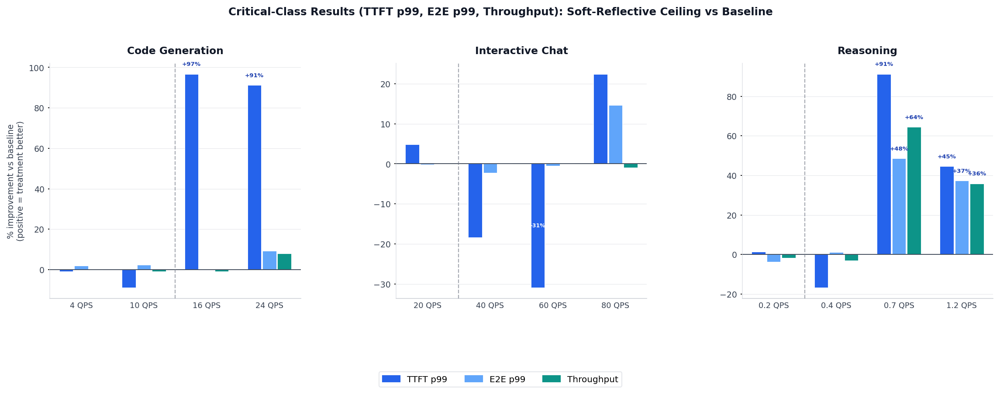

# From Simulation to Production Part II: Soft-Reflective Flow Control for llm-d

*Part 2 of the sim2real series. A case study in closing the AI-native loop across a second
problem class: dispatch prioritization.*

## Introduction

The [first article in this series](sim2real-probabilistic-admitter-llm-d.md) traced a
complete traversal of the AI-native loop for llm-d's admission control layer: an AI agent
framework ([Nous](https://github.com/AI-native-Systems-Research/agentic-strategy-evolution))
used a high-fidelity simulator ([BLIS](https://github.com/inference-sim/inference-sim)) to
discover a probabilistic, proactive admission control policy that cuts critical-traffic TTFT
by up to 97% at near-saturation workloads. That article restates the core methodology:
simulation lets the loop run at machine speed, reserving expensive GPU time for validating
the few candidates that actually merit real-hardware testing.

This article applies the same loop to a different problem: **flow control**. The distinction
matters. Admission control acts at the gate: it decides whether an incoming request enters the
system at all, and may reject it. Flow control acts at the dispatch queue: it decides which
already-admitted request gets sent to a backend server next. The two mechanisms protect different
points in the pipeline and neither replaces the other.

The concrete outcome is the **soft-reflective ceiling policy**: a new flow control plugin for
llm-d-router that reduces critical-class TTFT p99 by up to 98% at near-capacity load without
rejecting a single request. It is now merged into
[llm-d-router](https://github.com/llm-d/llm-d-router/tree/main/pkg/epp/framework/plugins/flowcontrol/usagelimits/softreflectiveceiling), and users can enable it today with a
single YAML change.

<!-- more -->

## Observe: The Flow Control Problem

llm-d's flow control framework gates dispatch of queued requests to backend servers based on
cluster saturation. Each priority band is assigned a ceiling value: when saturation reaches
or exceeds a band's ceiling, dispatch halts for that band.

The default flow control option, [static-usage-limit policy](https://github.com/llm-d/llm-d-router/tree/main/pkg/epp/framework/plugins/flowcontrol/usagelimits),
applies a single threshold to every priority band equally. Its default threshold is 1.0,
making it effectively a no-op: every band dispatches freely until pods are fully saturated.
Lowering the threshold does not help: setting threshold=0.5 gates critical traffic and
sheddable traffic at the same saturation point. There is no way to say "shed non-critical work
first." Under load, critical requests queue behind sheddable work, inflating TTFT for the
traffic that matters most.

## Reason + Change: Simulation-Driven Discovery

### The Simulator: BLIS

The same simulator used in Part 1, [BLIS](https://github.com/inference-sim/inference-sim)
(a high-fidelity discrete-event simulator for distributed LLM inference systems), provides the
economics that make agentic exploration viable. A single workload evaluation that takes 30
minutes on real hardware completes in seconds using BLIS. Nous can evaluate many candidate
policies across diverse workload conditions before a single GPU is reserved (see
[Part 1](sim2real-probabilistic-admitter-llm-d.md) for a full treatment of the simulator and
its role in the loop).

### The Discovery: Nous

Nous explored the space of flow control policies in simulation using the same hypothesis-driven
experimentation loop it applied to admission control. Given the objective of protecting
critical-band dispatch under load, it searched for a policy with two properties that binary
cliff policies lack: a dead zone at low saturation where no gating occurs (avoiding unnecessary
overhead when there is no contention), and a smooth ramp that becomes more aggressive as
saturation grows (avoiding oscillation at the threshold).

The algorithm that emerged has a strikingly natural form. For N priority bands, the
per-band ceiling is:

```
ceiling[0] = 1.0                         # critical: never gated
ceiling[i] = 1 - i * saturation / (N-1)  # linearly reflected
```

When the sheddable band's saturation exceeds its ceiling, rather than fully blocking, the
plugin rate-limits dispatch to every `round(saturation / (1 - saturation))`-th tick, a
proportional duty cycle that scales smoothly with load. The dispatch loop already treats
`saturation >= ceiling` as a head-of-line block, so alternating 1.0 and 0.0 on successive
ticks produces proportional throughput without any change to the dispatch code path.

For a two-tier deployment (critical + sheddable), the ceiling collapses to `1 - saturation`
for the sheddable band:

| Saturation | Regime | Critical ceiling | Critical blocked | Sheddable ceiling | Sheddable blocked |
|:---|:---|:---|:---|:---|:---|
| 0.00–0.50 | Below saturation: no gating | 1.00 | 0% | 1.00–0.50 | 0% |
| 0.50 | Boundary: gating begins | 1.00 | 0% | 0.50 | 0% |
| 0.60 | Proportional | 1.00 | 0% | 0.40 | 50% |
| 0.75 | Proportional | 1.00 | 0% | 0.25 | 67% |
| 0.90 | Proportional | 1.00 | 0% | 0.10 | 89% |
| ≥ 1.00 | Hard block | 1.00 | 0% | 0.00 | 100% |

The dead zone below saturation 0.5 means sheddable traffic flows freely at half-capacity and
below. The steep tail beyond 0.8 reserves nearly all dispatch capacity for critical traffic
without ever fully closing the sheddable gate: bounded latency, not indefinite starvation.

Compare this to the Part 1 algorithm: the probabilistic admitter has two constants discovered by
Nous (exponent 5, multiplier 300) tuned to hit a shedding curve of the right shape. The
reflective ceiling has no free parameters; the shape is determined entirely by the number of
priority bands and the current saturation reading. Adding a new priority level (a new `InferenceObjective` in llm-d-router's terms)
automatically extends the reflection with no config change.

### Simulation Results

Before committing to real-hardware benchmarks, BLIS confirmed the algorithm's direction across
three workload types:

| Workload | Input tokens | Output tokens | Critical/Sheddable | Models |
|:---|:---|:---|:---|:---|
| Code generation | ~1,176 (large) | ~195 (moderate) | 30/70 | IDE inline suggestions and CI/CD code review pipelines where critical suggestions share capacity with background analysis jobs. |
| Interactive chat | ~39 (short) | ~300 (moderate) | 30/70 | High-throughput conversational APIs serving mixed priority tiers. |
| Reasoning | ~780 (moderate) | ~6,200 (large) | 50/50 | Agent chains and multi-step planning where critical interactive queries compete with batch reasoning jobs. |

## AI-Assisted sim2real Translation: Simulation to Production Code

The [same sim2real translation pipeline from Part 1](sim2real-probabilistic-admitter-llm-d.md#ai-assisted-sim2real-translation-simulation-to-production-code) applies here. The agents work from the interface contract, produce a complete package with unit tests and parameter validation, and the output carries full provenance: a simulation-validated algorithm, translated by AI agents, ready to be registered and enabled with a YAML config change.

## Validate: Real-Cluster Benchmark Results

### Setup

| Parameter | Value |
|:---|:---|
| Hardware | 2 × H100-SXM-80GB |
| Model | Qwen/Qwen3-14B |
| Baseline | Default llm-d-router flow control (constant ceiling 1.0) |
| Treatment | soft-reflective-ceiling-policy |
| Load generator | blis observe (open-loop, --max-concurrency 10000) |

Note that this benchmark uses 2 × H100 rather than the 4 × H100 cluster used in Part 1,
reflecting a different hardware configuration while keeping the same model.

### Workloads

The real deployment was validated against the same workloads as the simulator: code generation,
interactive chat and reasoning.

All metrics below are for **critical-class traffic only**. Delta percentages show treatment
vs. baseline (negative = improvement).

### Results

The chart below covers all workloads and request rates, comparing the soft-reflective-ceiling-policy treatment to the default constant-ceiling baseline. Each QPS group shows three bars: TTFT p99 (dark blue), E2E p99 (light blue), and throughput (teal). Bars above zero indicate improvement; bars below zero indicate regression. The dashed vertical line in each panel marks where proportional gating begins.



### Reading the Results

The plugin's operating sweet spot is near-capacity load, where saturation fluctuates in the
proportional gating regime (0.5–1.0):

**Code generation @ 16 QPS** is the clearest signal. The baseline saturates on prefill
from 70%-sheddable large-input requests; critical TTFT p99 reaches 13.6 s. The treatment
proportionally gates sheddable dispatch, letting critical requests reach pods with minimal
wait: critical TTFT p99 falls to 263 ms, a 96.7% reduction. The difference between a 13-second
and a 263-millisecond time-to-first-token is the difference between a usable and an unusable
developer experience.

**Reasoning @ 0.7 QPS** shows the mechanism at work on long-running requests. Decode-heavy
workloads cause sustained high saturation, and the proportional gating continuously protects
critical prefill. Critical TTFT p99 drops from 330 s to 16 s (−91.2%), E2E improves −48.5%,
and throughput recovers 64.4%, because the baseline was overloaded enough to drop requests
that the treatment successfully completed.

**Under-capacity workloads** (code generation @ 4/10 QPS, interactive chat @ 20 QPS,
reasoning @ 0.2 QPS) show neutral results: saturation stays below the gating threshold and
the plugin is correctly a no-op. This is expected and important: a flow control policy that
penalizes traffic when there is no contention would cause harm rather than help.

**Interactive chat @ 40/60 QPS** shows the one range where the treatment is modestly worse
than baseline. These workloads operate near but not yet at capacity, in the transition zone
where the reflective ceiling begins to engage but the benefit of protecting critical dispatch
has not yet exceeded the overhead of rate-limiting sheddable traffic. The effect is small
(TTFT p99 +18% and +31% respectively at low absolute baseline values) and disappears at 80
QPS when the system is clearly above capacity.

## Deploy: A Contribution to llm-d

With real-cluster benchmarks confirming the gains predicted by simulation, the algorithm
ships upstream as a new plugin in llm-d-router: `soft-reflective-ceiling-policy`. Users can
enable it today with a single YAML change and no new infrastructure:

```yaml
apiVersion: llm-d.ai/v1alpha1
kind: EndpointPickerConfig
featureGates:
  - flowControl
plugins:
  - type: queue-scorer
  - type: kv-cache-utilization-scorer
  - type: prefix-cache-scorer
  - type: soft-reflective-ceiling-policy
schedulingProfiles:
  - name: default
    plugins:
      - pluginRef: queue-scorer
        weight: 2.0
      - pluginRef: kv-cache-utilization-scorer
        weight: 2.0
      - pluginRef: prefix-cache-scorer
        weight: 3.0
flowControl:
  usageLimitPolicyPluginRef: soft-reflective-ceiling-policy
```

The plugin is most effective for deployments operating at 60-100% capacity with a meaningful
fraction of sheddable traffic: code generation pipelines, batch reasoning jobs, background
inference tasks running alongside latency-sensitive critical traffic. Under-capacity deployments
see no effect. Deployments above 150% capacity are better served by admission control (which
can shed load at the gate) rather than flow control (which cannot reject requests, only
prioritize among admitted ones).

## Closing the Loop

A second traversal of the [same loop](sim2real-probabilistic-admitter-llm-d.md#closing-the-loop): constant-ceiling flow control left critical traffic queuing behind sheddable work; simulation-driven discovery produced the reflective ceiling algorithm; AI-assisted translation delivered a production Go plugin; real-cluster benchmarks on 2 × H100 confirmed up to 98% TTFT improvement at near-capacity load; and the plugin is now in llm-d-router, enabled with a YAML config change.

## What We Learned

Three lessons emerged from this iteration that were not obvious at the outset:

**Proportionality beats binary cliffs.** The constant-ceiling baseline flips abruptly between
fully-open and fully-blocked as saturation crosses a threshold. This causes oscillation and
provides no graceful degradation for the cases that matter most: moderate overload, where the
system is stressed but not catastrophic. A policy that smoothly ramps throttling intensity with
saturation is more stable and more useful across a wider operating range.

**A no-op at low load is a feature, not a bug.** The reflective ceiling guarantees the plugin
does nothing when saturation is below the band's reflection point. Confirming this in simulation
(the near-zero reasoning result at 0.2 QPS) gave confidence before real-hardware testing.
A flow control policy that penalizes traffic when there is no contention would cause harm.
Testing the absence of harm is as important as testing the presence of benefit.

**Simulation is conservative; real hardware quantifies the result.** The absolute gains on real
hardware exceeded simulation estimates. That gap is not a calibration failure; the simulator
cannot fully model GPU memory pressure, vLLM preemption cascades, and batching interference
under real load. Real gains may well meet or exceed what simulation predicts, not fall short.

## What Comes Next

This article and Part 1 together cover two distinct protection layers: admission control
reduces total load at the gate by probabilistically rejecting sheddable requests before they
enter the dispatch queue; flow control prioritizes dispatch among already-admitted requests.
Composing both provides layered protection: admission control prevents overload, flow control
ensures critical traffic is served first under normal-to-near-capacity operation.

The natural next frontier is exploring multiple interacting policies simultaneously: how
admission control and flow control compose under varying load, and what the joint policy space
looks like when Nous searches it rather than each mechanism in isolation. With BLIS becoming
the official llm-d simulator, this kind of multi-policy search becomes tractable. The same
simulation infrastructure that validated these two algorithms can explore interactions,
emergent behaviors, and entirely new problem classes: routing, autoscaling,
prefill-decode disaggregation.
