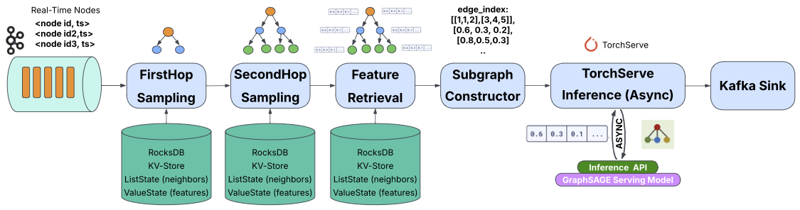

# Can an Agentic Harness Rediscover the Insights in a Research Paper?

*A case study characterizing a streaming GNN inference engine with Nous.*

**Try Nous yourself: [github.com/AI-native-Systems-Research/agentic-strategy-evolution](https://github.com/AI-native-Systems-Research/agentic-strategy-evolution)**

**Can an agentic research harness independently arrive at the same conclusions as a human researcher on a real systems problem?** To test this, we pointed [Nous](https://github.com/AI-native-Systems-Research/agentic-strategy-evolution), an agentic research harness, at the streaming GNN inference pipeline we had built and characterized in a recent paper. We gave it a research question and access to the target system, then let it run. The goal was twofold: to test whether the harness could reproduce the findings we had published, and to see whether it would surface anything we had missed.

<!-- more -->

## The Target System: Streaming GNN Inference on Flink

GNN inference computes a prediction for an entity by reading its *neighborhood* in a graph — its 1-hop neighbors, their neighbors, and so on. It powers fraud detection (the suspicious transaction's network of accounts), recommender systems (similar users and related items), and traffic forecasting. For real-time use, those neighborhoods need to be assembled and scored in milliseconds, against a graph that may be too large to fit on one machine.

Our [pipeline](https://dl.acm.org/doi/10.1145/3735546.3735856) runs on **Apache Flink**, a distributed stream processor designed for large-scale real-time event streams. Flink stores the graph as keyed state inside its workers — each node's neighbor list and feature vector is partitioned and sharded across machines. As inference requests arrive (each request is a node ID for which we want a prediction), the pipeline retrieves that node's 2-hop neighborhood from Flink state, assembles the local subgraph as JSON, sends it to a GraphSAGE model hosted in **TorchServe**, and emits the embedding.

*End-to-end pipeline for streaming GNN inference. A DataLoader job initializes graph state in Flink; the Inference job processes streamed node IDs through FirstHop / SecondHop sampling, feature retrieval, and subgraph construction, then issues an inference request to TorchServe.*

The paper evaluated this architecture on the Reddit dataset (233K nodes, 115M edges, 602-dim features) and reported how throughput and latency vary across worker counts, neighborhood sizes, and synchronous vs. asynchronous inference paths.

## How does Nous investigate a system on its own?

Nous is an agentic research harness built on top of state-of-the-art AI agents (e.g., Claude Code) and a structured scientific methodology for automated system experimentation. AI agents drive the research process; the harness provides the structure that guides hypothesis generation, experiment execution, evidence tracking, and iterative refinement. Internally, it runs an iterative loop: a planning agent proposes hypotheses with falsifiable predictions and candidate mechanisms, an execution agent runs experiments and records findings, and a principle store accumulates durable claims with evidence and confidence scores. Each iteration builds on what has been confirmed or refuted; predictions made in one iteration become tests for the next. This lets the harness systematically sweep configuration spaces, evaluate competing explanations in parallel, and characterize system behavior at a finer granularity than a time-constrained human researcher could realistically explore.

We ran three Nous campaigns on the streaming GNN pipeline, each targeting a different question: (a) could the harness reproduce the paper's main directional findings on its own, (b) could it surface configurations and edge cases we had not thought to test, and (c) could it instrument and characterize the TorchServe inference path at finer granularity than the paper reported. Each campaign ran five iterations, fully autonomous after launch — no hints, no intermediate corrections, no experiment designs from us. Total cost across the three: \~$110 in LLM calls, \~32 hours of wallclock. Campaign artifacts (configurations, ledgers, principles, and reports) are available at [REPLACE-WITH-YOUR-REPO-URL](https://github.com/REPLACE-WITH-YOUR-REPO-URL).

## What did the harness validate and uncover?

**The most important result is that the harness independently recovered all 7 of the paper's major directional conclusions.** Specifically:

* the number of TorchServe workers improves throughput up to a saturation point, after which adding more workers stops helping;  
* end-to-end median latency drops sharply as TorchServe workers are added, up to the same saturation point;  
* smaller 2-hop fanouts produce higher throughput than larger ones;  
* larger fanouts produce wider latency distributions, with more tail variance;  
* under sustained load, end-to-end latency stays bounded;  
* asynchronous inference outperforms synchronous inference;  
* as TorchServe worker count grows past the saturation point, the bottleneck shifts from TorchServe inference itself to Flink-side subgraph construction.

Numbers themselves shifted by 5–10× because the laptop has no GPU, but every shape, ordering, and threshold reproduced.

**Nous mapped where the result holds.**

The harness didn't just reproduce the paper's claim that async inference outperforms sync by \~35%; it asked when that advantage held. Sweeping across parallelism settings, it found that the gap is not constant. At parallelism 1, async outperformed sync by 25.7%, but at parallelism 2 or higher the advantage largely disappeared. The mechanism is intuitive in hindsight: multiple parallel synchronous operators collectively saturate TorchServe in much the same way as a single asynchronous operator. Rather than treating the async advantage as a single aggregate result, the harness mapped the regime in which that advantage exists.

**Nous found a failure mode we had never tested.**

The same sweep also surfaced a regime where async, the supposedly-faster path, collapses below sync. With both ASYNC\_CAPACITY (in-flight requests per operator) and operator parallelism pinned to 1, async throughput dropped to \~90 records/s while sync mode at the same parallelism sustained \~510. The async path does not degrade gracefully as its in-flight budget shrinks; below a threshold it stalls. We had not probed this corner ourselves; it is the kind of finding that comes from sweeping the configuration space rather than reasoning from priors.

**Nous went from a black-box metric to a mechanistic explanation.**

The campaigns then went a layer deeper into the inference path. Each request to TorchServe goes through three stages inside the model handler: preprocess (JSON → PyTorch tensors), inference (the GNN forward pass), and postprocess. The paper had reported per-request inference time as a single number; the harness instrumented the handler to log per-stage timing and correlated it against subgraph node count. Preprocessing dominated; scaling at \~0.011 ms/node versus 0.0076 ms/node for inference, and approaching **61%** of total handler time as subgraphs grow. JSON-to-tensor parsing, not the GNN forward pass, is the larger contributor and one that could be cut by replacing JSON with a binary encoding upstream.

**Nous connected the observation to its cause.**

It also re-ran a null result from the paper; that increasing TorchServe's request batch size does not improve throughput and confirmed it. More usefully, it went a step further and explained why: preprocessing dominates handler time and runs per-request, so batching cannot amortize it, and on CPU the inference step itself scales close to linearly with batch size, leaving little for batching to recover. The paper had stated the result; the harness restated it with a mechanism.

**Nous independently rediscovered a costly bottleneck.**

The same per-stage instrumentation also led the harness back to something we had hit during the original build. A single PyTorch threading parameter (TORCH\_INTRA\_THREADS) had cost us roughly two weeks of debugging. PyTorch's default of 64 caused thread thrashing on every per-request inference call: the per-call thread-pool barrier overhead far exceeded the small amount of actual compute. The cause was not visible from system-level metrics, and we had never explicitly set the value. Setting it to 1 was the fix. The harness rediscovered the same anti-pattern — bumping the value from 1 to 4 dropped end-to-end throughput by **13–37%** with no improvement in per-request inference time and named the mechanism correctly: intra-op threads contending for cores on a 16-core machine, with thread-pool barrier overhead dominating the \~0.2 ms of actual compute.

## What does this tell us about agentic research harnesses?

The most interesting outcome was not that the harness found something entirely different from the paper. It was that, starting from only a campaign description, it independently recovered all of the paper's major conclusions and then explored parts of the configuration space we had not characterized in detail. The harness reproduced the directional shape of every quantitative claim, refined one of those claims (the async-vs-sync result) with a sharper threshold, and identified a configuration combination that we had not thought to test ourselves.

That suggests a possible role for agentic research harnesses: not as a replacement for the researchers who design and build the system in the first place, but as a way to extend what any single researcher with limited time can practically characterize — sweeping combinations a human would skip, refining results that were reported at coarser granularity in the original work, and pointing back at specific lines of the implementation where the next fix or follow-up belongs.

## References

Naima Abrar Shami and Vasiliki Kalavri. 2025. Bridging GNN Inference and Dataflow Stream Processing: Challenges and Opportunities. In Proceedings of the 8th Joint Workshop on Graph Data Management Experiences & Systems (GRADES) and Network Data Analytics (NDA) (GRADES-NDA '25). Association for Computing Machinery, New York, NY, USA, Article 7, 1–10. https://doi.org/10.1145/3735546.3735856