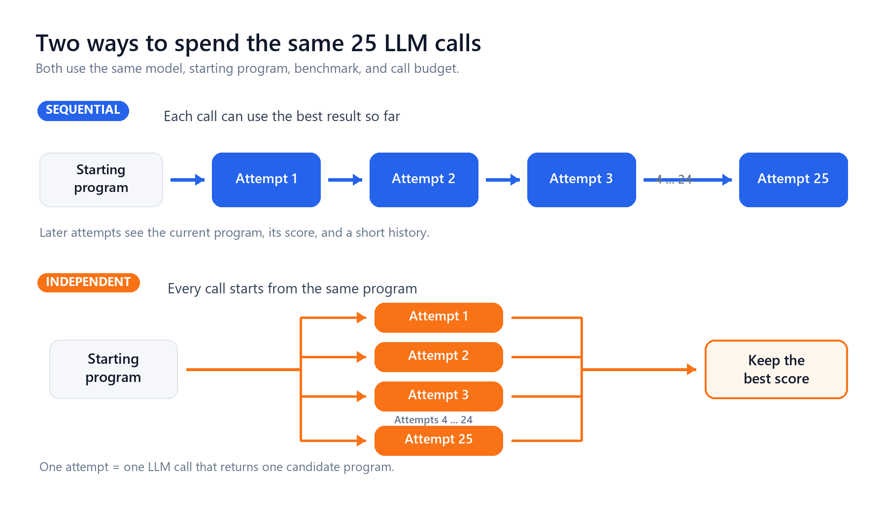
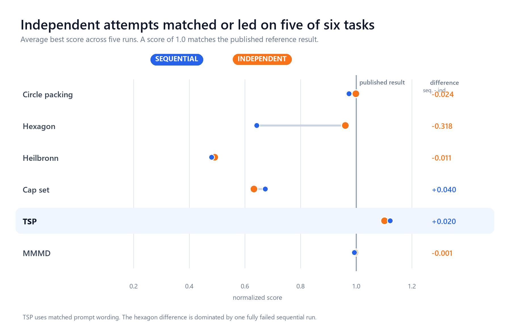
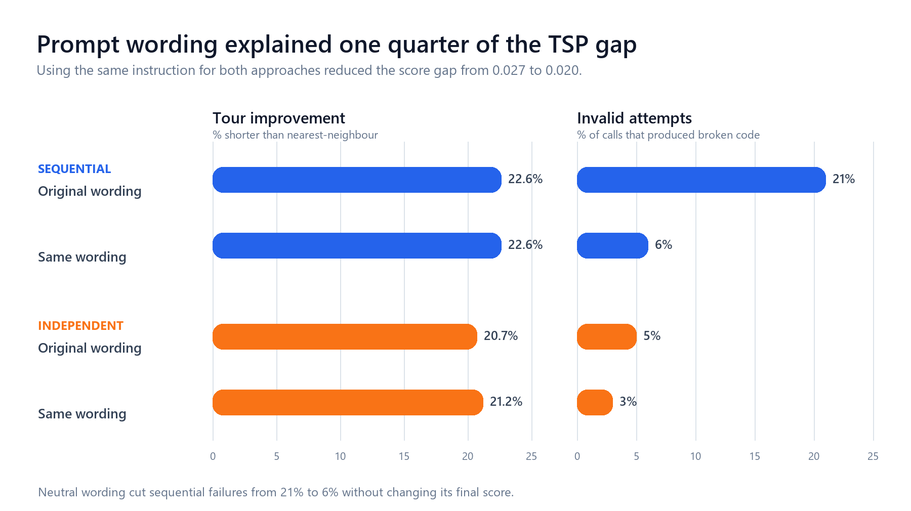
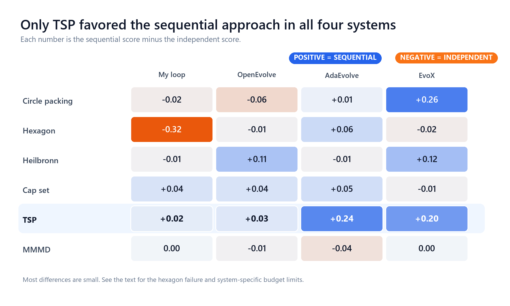

# The Simple Baseline I Could Not Beat

Our [Certus case study](discovery-is-easy-composition-is-hard.md) examined how LLM-driven optimizers discover and combine code changes. This post asks a complementary question: when does a sequence of improvements outperform independent attempts with the same LLM-call budget?

<!-- more -->

## Building Bilevel

I set out to build a better system for improving programs with an LLM.

Systems such as AlphaEvolve, OpenEvolve, FunSearch, AdaEvolve, and EvoX repeatedly ask an LLM to change the best program found so far. The same model may replace an algorithm, reorganize a data structure, or adjust a number such as a threshold or coefficient.

I thought those were two different jobs. An LLM is useful for changing the structure of code. A numerical optimizer should be better at tuning numbers.

So I built **Bilevel**. The LLM proposes structural changes and identifies numbers worth tuning. A Bayesian optimizer tunes those numbers separately. I liked the design. It gave each part of the system a clear job.

After a month of disappointing results, I began to wonder how much the evolutionary loop itself was helping. For the experiments in this post, I turned off the numerical optimizer and tested the loop on its own.

## The simple baseline

Suppose you have a budget of 25 LLM calls. You can spend it in two ways.

The **starting program** is the code the LLM is asked to improve. An **attempt** is one LLM call that returns a candidate program.

- **Sequential:** The 25 calls form one chain. The first sees the starting program. Each later call sees the current program, its score, and a short summary of earlier steps.
- **Independent or best of 25:** The 25 calls are separate. Each sees only the starting program. I keep the candidate with the best score.

Both setups use the same model, benchmark, scoring code, and call budget. Bilevel's numerical optimizer is off in both. The only difference is whether later calls can see earlier results.

I expected the sequential approach to win. It had memory and could build on previous improvements. The independent baseline threw that information away and started over on every call.

Instead, the independent baseline kept matching or beating my loop. I first suspected a bug. I tuned the setup, reran the experiments, and checked the scoring code. The pattern remained.

## What the papers reported

The result made me wonder whether I had rediscovered a standard baseline. I went back to the papers and looked for the same comparison.

Many papers report some form of no-evolution test, but I could not find this exact baseline in most of the work I checked. Eureka samples several candidates in one call and calls that its no-evolution baseline.[<a href="#ref-1">1</a>] AlphaEvolve and FunSearch remove parts of their evolutionary machinery. Most of these comparisons still let later calls use a current best program or otherwise retain information from earlier attempts.

My baseline removes that memory completely. Every attempt starts from the same program, none can see the other attempts, and only the best result is kept.

Two recent studies made the comparison especially relevant. In July 2026, Gupta et al. compared 30 systems across 12 model-problem pairs using more than **3.1 million LLM calls**.[<a href="#ref-2">2</a>] No system won everywhere, and the full OpenEvolve system often lost to simpler methods. Gideoni et al. found that random sampling could match or approach AlphaEvolve on several of its own benchmarks.[<a href="#ref-3">3</a>]

That gap changed the direction of my study. I decided to test published code-evolution systems against the same independent baseline.

## The six benchmarks

I used six benchmarks from the AlphaEvolve, FunSearch, and ReEvo papers. They differ from the benchmarks used by Gupta et al.

| benchmark | task | reference result from prior work |
|---|---|---|
| circle packing (n=32) | Pack 32 non-overlapping circles in the unit square; maximize the sum of their radii. | 2.937 (AlphaEvolve B.12) |
| hexagon (n=11) | Pack 11 unit hexagons inside a larger hexagon; minimize its side length. | 3.931 (AlphaEvolve B.7) |
| Heilbronn (n=13) | Place 13 points inside a convex region that the program also designs; maximize the smallest triangle area. | 0.0309 (AlphaEvolve B.10) |
| cap-set (F3^8) | Find the largest subset of {0,1,2}^8 with no three distinct elements summing to 0 modulo 3. | 512 (FunSearch / Tyrrell 2022) |
| TSP (n=100) | Find a short tour through 100 cities, measured against a nearest-neighbour tour. | ratio 1.15 (ReEvo, ICML 2024) |
| mmmd (d=3, n=14) | Place 14 points in 3D; maximize (minimum pairwise distance / maximum pairwise distance)^2. | 1/4.166 (AlphaEvolve B.8) |

I normalize each result against the published reference in the rightmost column, so 1.0 means matching it. Several geometry benchmarks start close to 1.0 and leave little room to improve. The TSP starting program must improve by about 13% to reach 1.0.

## How Bilevel performed

I ran each comparison with five random seeds, meaning five reproducible runs of the same setup. Best of 25 won or tied the sequential approach on **five of the six benchmarks**. TSP was the only clear sequential win.

This result applies only to this budget and setup. It does not show that earlier results can never help.

The hexagon result needs one qualification. Its mean difference is **-0.32**, but most of that gap comes from one sequential run in which all 25 attempts produced invalid programs and the run received a score of zero. If I score that run using its last working program, the apparent collapse disappears. Best of 25 still wins every paired comparison, so I trust the direction of the result more than its size.

## A prompt difference I had missed

I then read the prompts sent to the two setups and found a flaw. The setups differed in two ways. Sequential calls could see earlier results, while independent calls could not. They also received different instructions: the independent prompt asked for the strongest standalone solution, while the sequential prompt asked for a novel idea that did not repeat earlier attempts. If their scores differed, I could not tell how much came from access to history and how much came from the wording.

I reran TSP with identical wording. Both setups start from the same nearest-neighbour program, which scores 0.8696. Higher scores are better, and 1.0 means a tour 13% shorter than nearest-neighbour. The chart shows averages across five runs.

Matching the wording did not change the sequential score, but it improved best of 25. The gap fell from **+0.0272 to +0.0200**, so about one quarter of the original difference came from the prompt. The remaining gap was still statistically clear under an exact rank test (p = 0.0040).

The prompt also affected reliability. Asking for novelty raised the sequential failure rate from 6% to 21% without improving the final score. About four of every 25 calls produced broken code because of that wording.

## Where sequential search helped

TSP was the only benchmark with a clear sequential win. I ran five sequential runs and five independent runs, each with 25 LLM calls. Pooling the independent runs gave **5 x 25 = 125 attempts**. Every one of the five sequential runs scored higher than the best candidate in that pool.

Across the five runs, the sequential approach produced tours 22.6% shorter than nearest-neighbour, compared with 21.2% for best of 25.

I tested one additional diversity prompt only on TSP. It asked the independent attempts to try different strategies. The sequential result still held, but the prompt barely increased diversity among valid programs, so it was not a strong test.

## How many independent attempts matched one sequential run

I then used the five runs for each benchmark to estimate how many independent attempts were needed to match one 25-call sequential run:

- **Circle packing:** About 3.3 independent attempts, with a wide 95% interval from 2.3 to 23.
- **TSP:** More than 125 independent attempts, the largest pool I tested.

The estimate is rough. A self-check on pools of 25 independent attempts returned values from 12.5 to 51 across the six benchmarks. The numbers show the order of magnitude, not an exact exchange rate.

## A narrower explanation

I first thought geometry favored independent sampling while combinatorial problems favored sequential search. The data cannot separate problem type from the quality of the starting program. The geometry benchmarks start between 0.93 and 0.999, while TSP and cap-set leave much more room to improve.

My current hypothesis is that sequential search helps when one attempt usually stops short and later attempts can build on its progress. If one attempt already gets close to the best reachable result, history adds little. If independent attempts keep returning the same algorithm, later steps may help the model switch methods.

This is a hypothesis, not a general rule. The result may change with the model, system, benchmark, starting program, or evaluator.

Cap-set illustrates the uncertainty. Its average difference of +0.04 is not significant under an exact rank test (p = 0.571), so the main result is a tie. Yet none of the 125 independent attempts scored above 329/512, while 4 of 10 sequential runs scored between 381 and 400. The 400-point result uses the known optimal construction in F3^4, where 20^2 = 400. Sequential search sometimes found a stronger type of solution, but the sample is too small to tell how often that happens.

## Testing published systems

I repeated the comparison with **OpenEvolve**, **AdaEvolve**, and **EvoX**. For the independent baseline, I ran each system for one iteration from the starting program 25 separate times and kept the best result. No run could see another run's result.

My loop's TSP value uses matched prompts. Two OpenEvolve cells have four random seeds rather than five, and the other systems use their usual prompts. The hexagon gap also depends on how a completely failed run is scored. Most differences are small enough to treat as ties.

The same two patterns appeared in all four implementations. TSP favored sequential search. Outside TSP, no system showed a consistent advantage.

The TSP differences also suggest why. Independent AdaEvolve and EvoX attempts changed the code but kept the nearest-neighbour algorithm. Their sequential runs eventually switched algorithms. OpenEvolve sometimes made that switch in one attempt, so its independent baseline started stronger.

The comparison has limits. AdaEvolve used 28 to 33 calls in runs configured for 25 because it creates extra candidates when progress stalls. EvoX makes higher-level LLM calls outside the main budget. I also disabled some recommended features to keep the setups comparable. These tests do not represent the strongest versions of either system.

## Calls and usable programs

Twenty-five LLM calls do not always produce 25 valid candidates. Across these benchmarks, invalid attempts ranged from **5% on TSP to 84% on hexagon**. A 25-call budget therefore produced about 24 usable candidates in one case and only about 4 in the other.

Systems that repair invalid candidates or retry failed calls get more usable programs from the same stated budget. Experiments should report the number of LLM calls, the number of valid candidates scored, and token cost or elapsed time when available. Otherwise, two methods described as budget matched may have done very different amounts of useful work.

## What I would do next

1. **Report a fully independent best of N baseline.** Every attempt should start from the same program and remain hidden from the others.
2. **Report calls and valid candidates.** Failure rates are too different to summarize with one budget number.
3. **Estimate whether a sequence justifies its cost.** Compare it with the full range of independent results, not only with a single best of 25 score.
4. **Do not put the full budget into one chain by default.** Start several shorter chains, stop weak ones, and move the remaining budget to the promising ones.

These conclusions come from five random seeds per comparison, six benchmarks, and one generator model. With five seeds, the exact rank tests cannot produce a p-value below 0.004. The evidence rejects the claim that an evolutionary loop is always better, but it does not show that independent attempts are always better.

## References

**[1]** Ma, Liang, Wang, Huang, Bastani, Jayaraman, Zhu, Fan, and Anandkumar, "Eureka: Human-Level Reward Design via Coding Large Language Models," [arXiv:2310.12931](https://arxiv.org/abs/2310.12931), ICLR 2024.

**[2]** Gupta, Lei, Lu, Anumanchipalli, and Choshen, "Automated Discovery Has No Universally Superior Harness," [arXiv:2607.18235](https://arxiv.org/abs/2607.18235), 20 July 2026.

**[3]** Gideoni, Risi, and Gal, "Simple Baselines are Competitive with Code Evolution," [arXiv:2602.16805](https://arxiv.org/abs/2602.16805), 18 February 2026.
