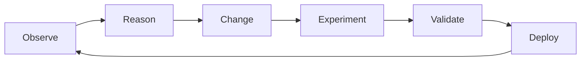

---
hide:
  - navigation
  - toc
---

# AI-native Systems Research

What if a system could observe its own behavior, hypothesize improvements,
validate them, and deploy — continuously, at machine speed?

  <a href="technical-domains/" class="md-button md-button--primary">Explore Domains</a>
  <a href="blog/" class="md-button md-button--secondary">Read the Blog</a>

---

## The Vision

Modern software systems serving AI workloads are extraordinarily complex and must evolve under relentless pressure — new models, new hardware, changing usage patterns, shifting objectives. Today, even with powerful AI tools, every improvement is mediated by humans step by step. This human-mediated loop has become the bottleneck.

**AI-native Systems** close this loop. In an AI-native System, AI is the primary agent of continuous creation, evolution, and operation. Humans define objectives, constraints, and governance — while the system continuously executes within those boundaries.

The continuous meta-loop: from observation to deployment, then back again.

---

## Architecture

An AI-native system consists of two parts:

### :material-cog-outline: System Under Control

The software system that delivers business value and is subject to continuous evolution — inference platforms, kernel pipelines, storage systems. It is not necessarily an AI system itself.

### :material-brain: Controlling System

The agentic AI-driven layer that continuously improves the System Under Control. It has two functions: a **Reasoner** (observes, hypothesizes, proposes goals) and a **Changer** (plans, experiments, produces artifacts).

---

## Key Principles

- **Continuous, proactive evolution** — not just reactive to failures, but seeking latent optimization opportunities
- **Governed autonomy** — every change has complete provenance: what, why, and evidence
- **Spec-driven development** — specifications are live documents that evolve with the system
- **Experimentation as a first-class activity** — exploring a space of possibilities, not relying on single proposed fixes
- **Hyper-specialization** — systems optimized for how they are actually used in each specific deployment
- **Simulation environments** — enabling rapid evolution and verification when real‑world experimentation is too costly (e.g., [BLIS](https://inference-sim.github.io/inference-sim/latest/), our high-fidelity and accurate llm-d simulator).

---

## Technical Domains

We are applying the AI-native vision to three initial domains:

### :material-server-network: llm-d

A Kubernetes-native distributed LLM inference framework. AI-native approaches drive intelligent scheduling, KV-cache optimization, and continuous performance tuning.

[:octicons-arrow-right-24: Learn more](technical-domains/llm-d.md)

### :material-chip: AI-Generated Kernels

Autonomous generation and optimization of compute kernels for GPUs and accelerators — driven by workload observations, evolutionary techniques, and continuous experimentation.

[:octicons-arrow-right-24: Learn more](technical-domains/ai-kernels.md)

### :material-database: Storage Systems

Applying the AI-native continuous improvement loop to storage infrastructure — enabling self-optimizing, workload-aware storage systems.

[:octicons-arrow-right-24: Learn more](technical-domains/storage-systems.md)

---

## Latest from the Blog

Check the [Blog](blog/index.md) for our latest posts on AI-native Systems research, progress updates, and deep dives into specific domains.

---

AI-native Systems Research · Apache 2.0

