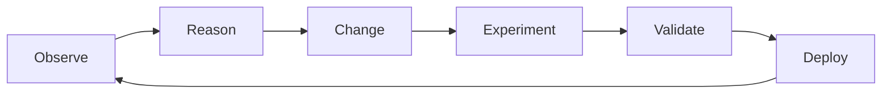
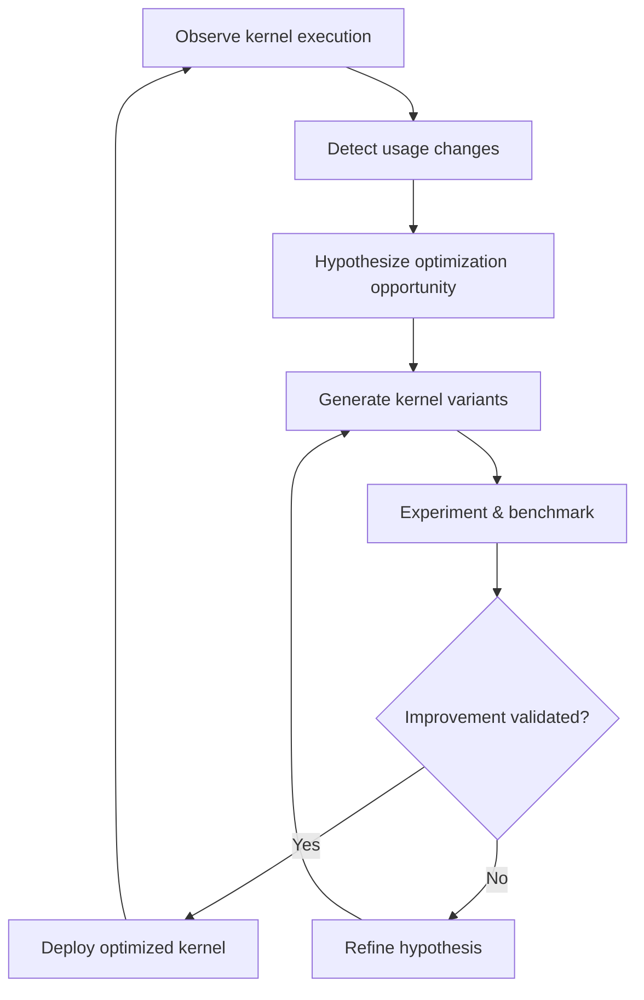

# MkDocs Landing Page Implementation Plan

> **For agentic workers:** REQUIRED SUB-SKILL: Use superpowers:subagent-driven-development (recommended) or superpowers:executing-plans to implement this plan task-by-task. Steps use checkbox (`- [ ]`) syntax for tracking.

**Goal:** Set up a Material for MkDocs site with a landing page, Technical Domains section, and blog for the AI-native Systems Research project.

**Architecture:** Static documentation site using Material for MkDocs. The landing page presents the AI-native Systems vision (observation → reasoning → change → validation → deployment loop). Three technical domain pages cover llm-d, AI-generated kernels, and storage systems. A blog section hosts posts about progress and deep dives. Design inspired by the inference-sim/BLIS repo's MkDocs setup.

**Tech Stack:** Python, Material for MkDocs (`mkdocs-material`), `pymdownx` extensions, `mkdocs-blog` plugin, Mike (versioning)

---

## File Structure

```
ai-native-systems-research/
├── mkdocs.yml                              # Site configuration
├── requirements.txt                        # Python dependencies
├── docs/
│   ├── index.md                            # Landing page (Home)
│   ├── stylesheets/
│   │   └── extra.css                       # Custom styles for hero section
│   ├── technical-domains/
│   │   ├── index.md                        # Technical Domains overview
│   │   ├── llm-d.md                        # llm-d inference platform
│   │   ├── ai-kernels.md                   # AI-generated GPU kernels
│   │   └── storage-systems.md              # Storage systems
│   └── blog/
│       ├── .authors.yml                    # Blog author definitions
│       └── posts/                          # Blog posts go here (empty initially)
│           └── .gitkeep
```

**Responsibilities:**
- `mkdocs.yml` — Theme config, nav, plugins, extensions (modeled after inference-sim)
- `requirements.txt` — Pinned deps for reproducible builds
- `docs/index.md` — Hero section, vision summary, key concepts, link to domains and blog
- `docs/stylesheets/extra.css` — Hero banner gradient, feature grid cards
- `docs/technical-domains/index.md` — Overview linking to the three domains
- `docs/technical-domains/llm-d.md` — llm-d description, link to llm-d.ai
- `docs/technical-domains/ai-kernels.md` — AI-generated kernel optimization
- `docs/technical-domains/storage-systems.md` — Storage systems domain
- `docs/blog/.authors.yml` — Blog author definitions
- `docs/blog/posts/` — Blog posts directory (empty initially)

---

## Task 1: Python Dependencies

**Files:**
- Create: `requirements.txt`

- [ ] **Step 1: Create requirements.txt**

```txt
mkdocs-material>=9.6
pillow
cairosvg
```

Note: `mkdocs-material>=9.6` includes the blog plugin. `pillow` and `cairosvg` are needed for social cards (optional but good to have).

- [ ] **Step 2: Verify install works**

Run:
```bash
pip install -r requirements.txt
```
Expected: All packages install successfully.

- [ ] **Step 3: Commit**

```bash
git add requirements.txt
git commit -m "chore: add MkDocs Material dependencies"
```

---

## Task 2: MkDocs Configuration

**Files:**
- Create: `mkdocs.yml`

- [ ] **Step 1: Create mkdocs.yml**

```yaml
site_name: AI-native Systems Research
site_description: >-
  Closing the loop — AI as the primary agent of continuous system evolution.
  Research and practice across inference platforms, GPU kernels, and storage systems.
site_url: https://ai-native-systems-research.github.io/ai-native-systems-research
repo_url: https://github.com/AI-native-Systems-Research/ai-native-systems-research
repo_name: AI-native-Systems-Research/ai-native-systems-research

theme:
  name: material
  palette:
    - media: "(prefers-color-scheme: light)"
      scheme: default
      primary: indigo
      accent: indigo
      toggle:
        icon: material/brightness-7
        name: Switch to dark mode
    - media: "(prefers-color-scheme: dark)"
      scheme: slate
      primary: indigo
      accent: indigo
      toggle:
        icon: material/brightness-4
        name: Switch to light mode
  features:
    - navigation.tabs
    - navigation.indexes
    - navigation.sections
    - navigation.expand
    - navigation.footer
    - navigation.top
    - search.highlight
    - search.suggest
    - content.code.copy
    - toc.follow
  icon:
    logo: material/brain
  custom_dir: overrides

extra_css:
  - stylesheets/extra.css

markdown_extensions:
  - admonition
  - attr_list
  - md_in_html
  - pymdownx.details
  - pymdownx.superfences:
      custom_fences:
        - name: mermaid
          class: mermaid
          format: !!python/name:pymdownx.superfences.fence_code_format
  - pymdownx.highlight:
      anchor_linenums: true
  - pymdownx.tabbed:
      alternate_style: true
  - pymdownx.tasklist:
      custom_checkbox: true
  - pymdownx.emoji:
      emoji_index: !!python/name:material.extensions.emoji.twemoji
      emoji_generator: !!python/name:material.extensions.emoji.to_svg
  - tables
  - toc:
      permalink: true

plugins:
  - search
  - blog:
      blog_dir: blog
      post_date_format: long
      categories_allowed:
        - Vision
        - llm-d
        - AI Kernels
        - Storage Systems
        - Architecture
        - Deep Dives

extra:
  version:
    provider: mike
    default: latest

nav:
  - Home: index.md
  - Technical Domains:
      - technical-domains/index.md
      - "llm-d: Inference Platform": technical-domains/llm-d.md
      - AI-Generated Kernels: technical-domains/ai-kernels.md
      - Storage Systems: technical-domains/storage-systems.md
  - Blog:
      - blog/index.md
```

- [ ] **Step 2: Commit**

```bash
git add mkdocs.yml
git commit -m "feat: add MkDocs Material configuration"
```

---

## Task 3: Custom Styles

**Files:**
- Create: `docs/stylesheets/extra.css`

- [ ] **Step 1: Create extra.css with hero and feature grid styles**

```css
/* Hero section */
.md-typeset .hero {
  text-align: center;
  padding: 2rem 1rem 3rem;
}

.md-typeset .hero h1 {
  font-size: 2.4rem;
  font-weight: 700;
  margin-bottom: 0.5rem;
}

.md-typeset .hero .hero-subtitle {
  font-size: 1.25rem;
  opacity: 0.8;
  max-width: 720px;
  margin: 0 auto 2rem;
}

.md-typeset .hero .hero-buttons {
  display: flex;
  gap: 1rem;
  justify-content: center;
  flex-wrap: wrap;
}

.md-typeset .hero .hero-buttons a {
  display: inline-block;
  padding: 0.6rem 1.5rem;
  border-radius: 4px;
  font-weight: 600;
  text-decoration: none;
}

.md-typeset .hero .hero-buttons .md-button--primary {
  background-color: var(--md-primary-fg-color);
  color: var(--md-primary-bg-color);
}

.md-typeset .hero .hero-buttons .md-button--secondary {
  border: 2px solid var(--md-primary-fg-color);
  color: var(--md-primary-fg-color);
}

/* Feature grid */
.md-typeset .feature-grid {
  display: grid;
  grid-template-columns: repeat(auto-fit, minmax(280px, 1fr));
  gap: 1.5rem;
  margin: 2rem 0;
}

.md-typeset .feature-card {
  border: 1px solid var(--md-default-fg-color--lightest);
  border-radius: 8px;
  padding: 1.5rem;
  transition: box-shadow 0.2s;
}

.md-typeset .feature-card:hover {
  box-shadow: 0 4px 16px rgba(0, 0, 0, 0.1);
}

.md-typeset .feature-card h3 {
  margin-top: 0;
}

/* Domain cards */
.md-typeset .domain-grid {
  display: grid;
  grid-template-columns: repeat(auto-fit, minmax(300px, 1fr));
  gap: 1.5rem;
  margin: 2rem 0;
}

.md-typeset .domain-card {
  border: 1px solid var(--md-default-fg-color--lightest);
  border-radius: 8px;
  padding: 1.5rem;
  transition: box-shadow 0.2s, transform 0.2s;
}

.md-typeset .domain-card:hover {
  box-shadow: 0 4px 16px rgba(0, 0, 0, 0.1);
  transform: translateY(-2px);
}

.md-typeset .domain-card h3 {
  margin-top: 0;
}
```

- [ ] **Step 2: Commit**

```bash
git add docs/stylesheets/extra.css
git commit -m "feat: add custom CSS for hero and feature grid"
```

---

## Task 4: Landing Page (Home)

**Files:**
- Create: `docs/index.md`

- [ ] **Step 1: Create the landing page**

```markdown
---
hide:
  - navigation
  - toc
---

<div class="hero" markdown>

# AI-native Systems Research

<p class="hero-subtitle">
What if a system could observe its own behavior, hypothesize improvements,
validate them, and deploy — continuously, at machine speed?
</p>

<div class="hero-buttons">
  <a href="technical-domains/" class="md-button md-button--primary">Explore Domains</a>
  <a href="blog/" class="md-button md-button--secondary">Read the Blog</a>
</div>

</div>

---

## The Vision

Modern software systems serving AI workloads are extraordinarily complex and must evolve under relentless pressure — new models, new hardware, changing usage patterns, shifting objectives. Today, even with powerful AI tools, every improvement is mediated by humans step by step. This human-mediated loop has become the bottleneck.

**AI-native Systems** close this loop. In an AI-native System, AI is the primary agent of continuous creation, evolution, and operation. Humans define objectives, constraints, and governance — while the system continuously executes within those boundaries.



<p style="text-align: center; opacity: 0.7; font-size: 0.9rem;">
The continuous meta-loop: from observation to deployment, then back again.
</p>

---

## Architecture

An AI-native system consists of two parts:

<div class="feature-grid" markdown>

<div class="feature-card" markdown>

### :material-cog-outline: System Under Control

The software system that delivers business value and is subject to continuous evolution — inference platforms, kernel pipelines, storage systems. It is not necessarily an AI system itself.

</div>

<div class="feature-card" markdown>

### :material-brain: Controlling System

The agentic AI-driven layer that continuously improves the System Under Control. It has two functions: a **Reasoner** (observes, hypothesizes, proposes goals) and a **Changer** (plans, experiments, produces artifacts).

</div>

</div>

---

## Key Principles

- **Continuous, proactive evolution** — not just reactive to failures, but seeking latent optimization opportunities
- **Governed autonomy** — every change has complete provenance: what, why, and evidence
- **Spec-driven development** — specifications are live documents that evolve with the system
- **Experimentation as a first-class activity** — exploring a space of possibilities, not relying on single proposed fixes
- **Hyper-specialization** — systems optimized for how they are actually used in each specific deployment

---

## Technical Domains

We are applying the AI-native vision to three initial domains:

<div class="domain-grid" markdown>

<div class="domain-card" markdown>

### :material-server-network: llm-d

A Kubernetes-native distributed LLM inference framework. AI-native approaches drive intelligent scheduling, KV-cache optimization, and continuous performance tuning.

[:octicons-arrow-right-24: Learn more](technical-domains/llm-d.md)

</div>

<div class="domain-card" markdown>

### :material-chip: AI-Generated Kernels

Autonomous generation and optimization of compute kernels for GPUs and accelerators — driven by workload observations, evolutionary techniques, and continuous experimentation.

[:octicons-arrow-right-24: Learn more](technical-domains/ai-kernels.md)

</div>

<div class="domain-card" markdown>

### :material-database: Storage Systems

Applying the AI-native continuous improvement loop to storage infrastructure — enabling self-optimizing, workload-aware storage systems.

[:octicons-arrow-right-24: Learn more](technical-domains/storage-systems.md)

</div>

</div>

---

## Latest from the Blog

Check the [Blog](blog/index.md) for our latest posts on AI-native Systems research, progress updates, and deep dives into specific domains.

---

<p style="text-align: center; opacity: 0.6; font-size: 0.85rem;">
AI-native Systems Research · Apache 2.0
</p>
```

- [ ] **Step 2: Verify the page renders**

Run:
```bash
mkdocs serve
```
Expected: Site builds and renders at `http://127.0.0.1:8000`. The landing page should show hero section, vision, architecture cards, principles, domain cards, and blog link.

- [ ] **Step 3: Commit**

```bash
git add docs/index.md
git commit -m "feat: add landing page with vision and domain cards"
```

---

## Task 5: Technical Domains Pages

**Files:**
- Create: `docs/technical-domains/index.md`
- Create: `docs/technical-domains/llm-d.md`
- Create: `docs/technical-domains/ai-kernels.md`
- Create: `docs/technical-domains/storage-systems.md`

- [ ] **Step 1: Create domains index page**

```markdown
# Technical Domains

We are applying the AI-native Systems vision to three initial technical domains. Each represents a complex software system under constant pressure to evolve — and each stands to benefit from continuous, AI-driven improvement.

<div class="domain-grid" markdown>

<div class="domain-card" markdown>

### :material-server-network: llm-d — Inference Platform

A Kubernetes-native distributed LLM inference framework where AI-native approaches drive scheduling, caching, and performance optimization.

[:octicons-arrow-right-24: llm-d](llm-d.md)

</div>

<div class="domain-card" markdown>

### :material-chip: AI-Generated Kernels

Autonomous generation and continuous optimization of compute kernels for GPUs and accelerators, driven by real workload observations.

[:octicons-arrow-right-24: AI-Generated Kernels](ai-kernels.md)

</div>

<div class="domain-card" markdown>

### :material-database: Storage Systems

Self-optimizing storage infrastructure that evolves based on actual usage patterns and workload characteristics.

[:octicons-arrow-right-24: Storage Systems](storage-systems.md)

</div>

</div>
```

- [ ] **Step 2: Create llm-d page**

```markdown
# llm-d — Kubernetes-Native LLM Inference

[llm-d](https://llm-d.ai) is a Kubernetes-native, high-performance distributed LLM inference framework. It provides the fastest time-to-value and competitive performance per dollar for serving language models across diverse hardware accelerators.

---

## Why llm-d for AI-native Research?

LLM inference platforms are ideal proving grounds for the AI-native approach. They are:

- **Complex and multi-component** — schedulers, KV caches, model servers, routing layers
- **Under constant pressure** — new models, new hardware, shifting traffic patterns
- **Multi-objective** — latency, throughput, cost, and fairness must be traded off
- **Observable** — rich telemetry from every request through the pipeline

---

## Key Capabilities

- **Inference scheduling** — intelligent request routing and scheduling
- **KV-cache optimization** — hierarchical offloading, cache-aware LoRA routing
- **Prefill/Decode disaggregation** — separating compute phases for efficiency
- **Wide Expert Parallelism** — load balancing across MoE experts
- **Scale-to-zero autoscaling** — resource-efficient scaling
- **Resilient networking with UCCL** — reliable distributed communication

---

## AI-native Opportunities

In the AI-native vision, the inference platform continuously observes its own behavior — request latencies, queue depths, cache hit rates, GPU utilization — and uses this telemetry to drive improvements. These improvements span:

- **Configuration tuning** — batch sizes, scheduling policies, cache parameters
- **Code changes** — algorithmic improvements to routing, scheduling, or memory management
- **Structural evolution** — new components, refactored interfaces, optimized pipelines

The Controlling System reasons about multi-objective tradeoffs and experiments with alternatives before deploying validated changes.

---

## Resources

- **Website:** [llm-d.ai](https://llm-d.ai)
- **GitHub:** [github.com/llm-d](https://github.com/llm-d)
```

- [ ] **Step 3: Create AI-generated kernels page**

```markdown
# AI-Generated Kernels for GPUs and Accelerators

Compute kernels for accelerators like GPUs are at the heart of AI workloads. These kernels must be optimized for specific model families, data layouts, mathematical representations, and hardware models. Today, this optimization is a manual, expert-driven process. AI-native Systems change this fundamentally.

---

## The Opportunity

In a production inference environment, kernel usage varies over time. Some kernels are heavily exercised while others go unused. When new models arrive or workload patterns shift, kernels that were once idle become critical — and may not be optimized for their new usage profile.

An AI-native approach continuously observes kernel execution on the accelerator. When it detects changes in usage patterns — a kernel seeing new dimensions, increased frequency, or novel access patterns — it hypothesizes that there is room for improvement, even without an SLO violation.

---

## How It Works



The system uses LLM-based evolutionary approaches, reinforcement learning, or hybrid methods to generate and refine kernel variants. Each candidate is benchmarked against the production workload profile, and only validated improvements are deployed.

---

## Key Properties

- **Workload-aware** — kernels optimized for actual usage, not synthetic benchmarks
- **Continuous** — optimization runs alongside production, not as a one-time effort
- **Environment-specific** — each deployment gets kernels tuned for its particular hardware and workload mix
- **Human-optional** — the full loop from detection to deployment can run autonomously, with human gating as desired

---

## Related Work

This builds on evolutionary code improvement techniques demonstrated by systems such as Sky-Discover, Kernel Bench, and OpenEvolve. AI-native Systems generalize these ideas into a continuous, governed loop.
```

- [ ] **Step 4: Create storage systems page**

```markdown
# Storage Systems

Storage systems — filesystems, object stores, resource managers — are among the most complex and long-lived software systems in production. They serve diverse workloads, run on heterogeneous hardware, and must balance performance, durability, cost, and consistency. These properties make them both challenging and highly rewarding targets for AI-native approaches.

---

## Why Storage?

Storage systems exhibit the characteristics that benefit most from continuous AI-driven evolution:

- **Deep complexity** — distributed coordination, caching hierarchies, replication strategies
- **Multi-objective tradeoffs** — latency vs. throughput vs. durability vs. cost
- **Workload sensitivity** — performance depends heavily on access patterns that change over time
- **Rich observability** — I/O traces, latency distributions, cache statistics, capacity metrics

---

## AI-native Vision for Storage

The Controlling System observes storage telemetry and identifies opportunities:

- **Configuration optimization** — cache sizes, prefetch policies, compaction schedules tuned to actual access patterns
- **Algorithmic improvements** — better data placement, tiering decisions, or replication strategies
- **Structural changes** — refactored indexing, new caching layers, or workload-specific optimizations

These changes are validated through experimentation — benchmarks, simulation, or shadow traffic — before deployment.

---

## Research Directions

- Workload-adaptive caching and tiering
- AI-driven data placement and migration
- Self-tuning distributed consensus and replication
- Continuous performance optimization for specific deployment environments
```

- [ ] **Step 5: Verify all pages render**

Run:
```bash
mkdocs serve
```
Expected: All four Technical Domains pages render correctly. Navigation tabs show Home, Technical Domains, and Blog. Domain pages are accessible from both the nav and the domain cards on the landing page.

- [ ] **Step 6: Commit**

```bash
git add docs/technical-domains/
git commit -m "feat: add Technical Domains section with llm-d, kernels, and storage pages"
```

---

## Task 6: Blog Setup (Empty)

**Files:**
- Create: `docs/blog/.authors.yml`
- Create: `docs/blog/posts/.gitkeep`

- [ ] **Step 1: Create blog authors file**

```yaml
authors:
  fabio:
    name: Fabio A. Oliveira
    description: AI-native Systems Researcher
```

- [ ] **Step 2: Create empty posts directory**

```bash
mkdir -p docs/blog/posts
touch docs/blog/posts/.gitkeep
```

The blog plugin will generate an empty blog index. Posts can be added later by creating markdown files in `docs/blog/posts/`.

- [ ] **Step 3: Verify the blog section renders**

Run:
```bash
mkdocs serve
```
Expected: Blog tab appears in navigation. The blog index page renders with no posts.

- [ ] **Step 4: Commit**

```bash
git add docs/blog/
git commit -m "feat: add empty blog section with authors config"
```

---

## Task 7: Overrides Directory and Final Wiring

**Files:**
- Create: `overrides/.gitkeep`
- Modify: `README.md`

- [ ] **Step 1: Create overrides directory placeholder**

The `mkdocs.yml` references `overrides` as `custom_dir`. Create it at the project root (not inside `docs/`, to avoid MkDocs treating override files as documentation pages):

```bash
mkdir -p overrides
touch overrides/.gitkeep
```

- [ ] **Step 2: Update README.md**

```markdown
# AI-native Systems Research

Research and practice in AI-native Systems — where AI is the primary agent of continuous system evolution.

## Documentation

This site is built with [Material for MkDocs](https://squidfunk.github.io/mkdocs-material/).

### Local development

```bash
pip install -r requirements.txt
mkdocs serve
```

Visit `http://127.0.0.1:8000` to preview locally.

### Build

```bash
mkdocs build
```

## License

Apache License 2.0 — see [LICENSE](LICENSE).
```

- [ ] **Step 3: Add .gitignore**

```
site/
__pycache__/
*.pyc
.venv/
```

The `site/` directory is the MkDocs build output and should not be committed.

- [ ] **Step 4: Final verification**

Run:
```bash
mkdocs build --strict
```
Expected: Build succeeds with no warnings. The `site/` directory is created with all pages.

Run:
```bash
mkdocs serve
```
Expected: Full site renders — Home tab with hero, Technical Domains tab with three domain pages, Blog tab with the inaugural post. Light/dark mode toggle works. Navigation tabs, search, and code copy all functional.

- [ ] **Step 5: Commit**

```bash
git add overrides/.gitkeep README.md .gitignore
git commit -m "feat: add overrides dir, update README, add gitignore"
```
