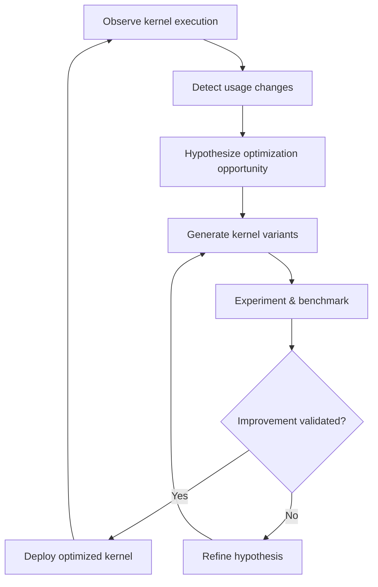

# AI-Generated Kernels for GPUs and Accelerators

Compute kernels for accelerators like GPUs are at the heart of AI workloads. These kernels must be optimized for specific model families, data layouts, mathematical representations, and hardware models. Today, this optimization is a manual, expert-driven process. AI-Native Systems change this fundamentally.

---

## The Opportunity

In a production inference environment, kernel usage varies over time. Some kernels are heavily exercised while others go unused. When new models arrive or workload patterns shift, kernels that were once idle become critical — and may not be optimized for their new usage profile.

An AI-native approach continuously observes kernel execution on the accelerator. When it detects changes in usage patterns — a kernel seeing new dimensions, increased frequency, or novel access patterns — it hypothesizes that there is room for improvement, even without an SLO violation.

---

## How It Works

The system uses LLM-based evolutionary approaches, reinforcement learning, or hybrid methods to generate and refine kernel variants. Each candidate is benchmarked against the production workload profile, and only validated improvements are deployed.

---

## Key Properties

- **Workload-aware** — kernels optimized for actual usage, not synthetic benchmarks
- **Continuous** — optimization runs alongside production, not as a one-time effort
- **Environment-specific** — each deployment gets kernels tuned for its particular hardware and workload mix
- **Human-optional** — the full loop from detection to deployment can run autonomously, with human gating as desired

---

## Related Work

This builds on evolutionary code improvement techniques demonstrated by systems such as Sky-Discover, Kernel Bench, and OpenEvolve. AI-Native Systems generalize these ideas into a continuous, governed loop.
